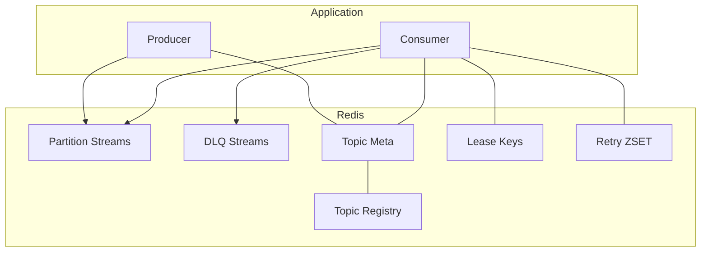

# 架构总览

该文档概述系统整体架构，并突出 MQ（Redis Streams）子系统的角色与交互。详细设计见 `MQ-Design.md`。

## 模块
- core, mq, registry, runtime, state/window/aggregation/join/cdc/sink/source, metrics, spring-boot-starter, examples。

## 逻辑架构

## 运行时线程模型
- 每个被分配的分区一个串行 Worker；独立调度池负责租约续约、XAUTOCLAIM、指标与延迟重试搬运。

## 故障处理
- 实例宕机：租约过期，其他实例竞争获取；对孤儿 pending 执行 XAUTOCLAIM。
- 处理失败：按策略重试或入 DLQ；DLQ 可回放。

## 取舍
- 无协调器、低运维，但再均衡是最终一致；通过短 TTL 与幂等性降低风险。

## 核心命令与 Kafka 映射（速览）
- 生产写入：`XADD stream:topic:{t}:p:{i}` ≈ Kafka Producer 发送到分区
- 组创建：`XGROUP CREATE` ≈ Kafka 创建消费组
- 组读取：`XREADGROUP GROUP <g> <c>` ≈ Kafka 拉取（含批量与阻塞）
- 提交位点：`XACK` ≈ Kafka commit
- 待处理查询：`XPENDING` ≈ in-flight（Kafka 无直接命令）
- 孤儿接管：`XAUTOCLAIM`/`XCLAIM` ≈ 再均衡后接管未确认记录
- 分区独占：`SET NX EX` + `EXPIRE`（租约）≈ 组协调器分配分区
- 延迟重试：`ZADD/ZRANGEBYSCORE/ZREM` + `EVAL`（Lua搬运）≈ 重试主题/延迟回放
- 保留/裁剪：`XTRIM MAXLEN/MINID` ≈ retention.bytes/retention.ms
- 死信：`XADD stream:topic:{t}:dlq` ≈ DLQ 主题；回放 `XRANGE + XADD`
