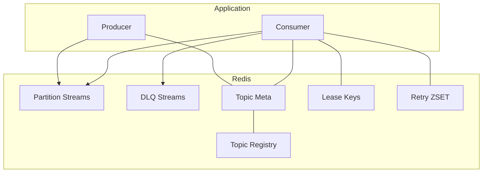

# 架构总览

该文档概述系统整体架构，并突出 MQ（Redis Streams）子系统的角色与交互。详细设计见 `MQ-Design.md`。

## 模块

Gradle 多模块工程，模块清单与 `settings.gradle` 一致（20 个）：

| 层 | 模块 |
|---|---|
| Tier 1 核心抽象 | `core`（API 抽象）、`runtime`（流处理运行时引擎） |
| Tier 2 基础设施 | `mq`、`registry`、`config`、`state`、`checkpoint`、`watermark` |
| Tier 3 特性 | `window`、`aggregation`、`table`、`join`、`cdc`、`sink`、`source` |
| Tier 4 高级特性 | `reliability`、`cep` |
| Tier 5 集成 | `metrics`、`spring-boot-starter`、`examples` |

## 逻辑架构

```mermaid
flowchart TB
  subgraph Application
    PD[Producer]
    CS[Consumer]
  end
  subgraph Redis
    PART[Partition Streams]
    DLQ[DLQ Streams]
    META[Topic Meta]
    REG[Topic Registry]
    LEASE[Lease Keys]
    RETRY[Retry ZSET]
  end
  PD-->PART
  CS-->PART
  CS-->DLQ
  PD---META
  CS---META
  META---REG
  CS---LEASE
  CS---RETRY
```

## 运行时线程模型
- 每个被分配的分区一个串行 Worker；独立调度池负责租约续约、pending 扫描与接管（`XPENDING`+`XCLAIM`）、指标与延迟重试搬运（调度线程数由 `MqOptions.schedulerThreads` 控制，默认 2）。

## 故障处理
- 实例宕机：租约过期，其他实例竞争获取；对孤儿 pending 执行 `XPENDING`+`XCLAIM` 接管。
- 处理失败：按策略重试或入 DLQ；DLQ 可回放。

## 取舍
- 无协调器、低运维，但再均衡是最终一致；通过短 TTL 与幂等性降低风险。

## 核心命令与 Kafka 映射（速览）
- 生产写入：`XADD stream:topic:{t}:p:{i}` ≈ Kafka Producer 发送到分区（键格式见 `mq/.../partition/StreamKeys.java`，前缀可通过 `StreamKeys.configure` 调整）
- 组创建：`XGROUP CREATE` ≈ Kafka 创建消费组
- 组读取：`XREADGROUP GROUP <g> <c>` ≈ Kafka 拉取（含批量与阻塞）
- 提交位点：`XACK` ≈ Kafka commit
- 待处理查询：`XPENDING` ≈ in-flight（Kafka 无直接命令）
- 孤儿接管：`XPENDING`+`XCLAIM` ≈ 再均衡后接管未确认记录
- 分区独占：`SET NX EX` + `EXPIRE`（租约）≈ 组协调器分配分区
- 延迟重试：`ZADD/ZRANGEBYSCORE/ZREM` + `EVAL`（Lua搬运）≈ 重试主题/延迟回放
- 保留/裁剪：`XTRIM MAXLEN/MINID` ≈ retention.bytes/retention.ms
- 死信：`XADD stream:topic:{t}:dlq` ≈ DLQ 主题；回放 `XRANGE + XADD`
