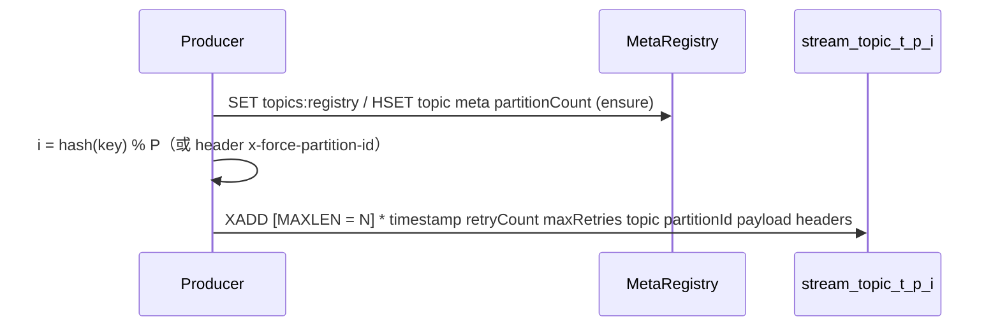
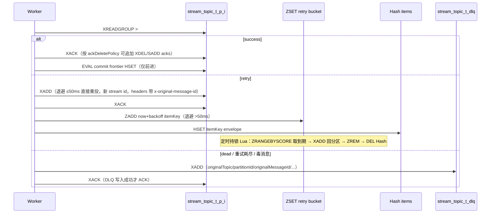
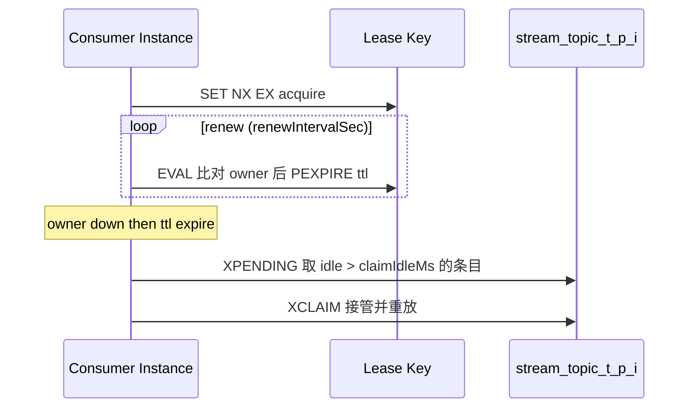

# MQ 与 Redis 交互（Broker Interaction）

本文梳理 `mq/` 模块实际用到的 Redis 命令、序列图与用途，便于对照 Kafka 语义理解与排障。命令清单逐条核对过 `mq/src/main/java`：实现经 Redisson API（`RStream`/`RScript`/`RBucket` 等）执行，下表给出对应底层命令。

键名约定：控制键前缀 `keyPrefix`（默认 `streaming:mq`），数据流前缀 `streamKeyPrefix`（默认 `stream:topic`），见 `partition/StreamKeys`。

## 核心命令

- 生产写入
  - `XADD stream:topic:{t}:p:{i} [MAXLEN = N] * field value …`：往分区流写消息；返回 `timestamp-seq` 形式的 messageId。配置 `retentionMaxLenPerPartition > 0` 时由 Lua 原子执行 `XADD ... MAXLEN = N`（`=` 精确裁剪，Redis 7+；旧版回退 `XADD` + `XTRIM` + 分页 `XDEL` 兜底）。
- 消费与消费组
  - `XGROUP CREATE <stream> <group> 0-0 MKSTREAM`：创建消费组（`subscribe` 与 `DefaultBroker.readGroup` 都先经 Lua 检查 `XINFO GROUPS`，`BUSYGROUP` 视为已存在）。建组位点 `0-0`，组创建前的 backlog 同样投递。
  - `XREADGROUP GROUP <group> <consumer> COUNT n BLOCK ms STREAMS <stream> >`：组内读取未投递条目（Redisson `StreamReadGroupArgs.neverDelivered()`）。
  - `XACK <stream> <group> <id …>`：确认处理完成，从 Pending 移除。
  - `XPENDING <stream> <group> <start> <end> <count>`（Redisson `listPending`）：查询未 ack 条目（idle、投递次数）。
  - `XCLAIM <stream> <group> <consumer> <min-idle-time> <id>`（Redisson `claim`）：认领 idle 超过 `claimIdleMs` 的孤儿 pending。实现使用 `listPending + claim` 组合，未使用 `XAUTOCLAIM`。
- ACK 后删除策略（`MqOptions.ackDeletePolicy`，默认 `none`）
  - `immediate`：`XACK` 后 `XDEL`（仅单组消费安全）。
  - `all-groups-ack`：`SADD streaming:mq:acks:{t}:p:{i}:{id} <group>`（TTL `acksetTtlSec`）；当集合大小 ≥ `XINFO GROUPS` 的注册组数时 `XDEL` 并删集合。
- 提交位点
  - `EVAL <lua>`：ACK 后原子维护 `streaming:mq:commit:{t}:p:{i}`（Hash，field=组）——仅当新 id（`ms-seq` 比较）大于已存值才 `HSET`。
- 故障恢复与再均衡
  - `SET streaming:mq:lease:{t}:{g}:{i} <consumerId> NX EX <ttl>`：获取分区租约。
  - `EVAL <lua>`：续约（比对本人 id 后 `PEXPIRE`）与释放（比对本人 id 后 `DEL`），避免误删继任者租约。
- 延迟重试
  - `ZADD streaming:mq:retry:{t} <dueAtMs> <itemKey>`：条目按到期时间入重试桶（有序集合）。
  - `HSET streaming:mq:retry:item:{t}:{uuid} topic ... partitionId ... payload ... key ... headers ... retryCount ... maxRetries ... originalMessageId ...`：多字段字符串 envelope；`payload`/`headers` 为 JSON 编码，null payload 不写 `payload` 字段。
  - 分布式锁 `streaming:mq:retry:lock:{t}`（Redisson `RLock`，等待 `retryLockWaitMs`、持有 `retryLockLeaseMs`）：同一 Topic 的搬运互斥。注意该键是字面常量，不随 `keyPrefix` 变化。
  - `EVAL <lua>`：原子执行「`ZRANGEBYSCORE` 取到期（≤ `retryMoverBatch` 条）→ `XADD` 回分区 → `ZREM` → `DEL` Hash」。
- 死信队列（DLQ）
  - `XADD stream:topic:{t}:dlq * ...`：死信字段含 `originalTopic / partitionId / originalMessageId / retryCount / maxRetries / timestamp / failedAt / headers / payload`。
  - 回放：`XRANGE <dlq> <id> <id>` 读出后按 `partitionId` `XADD stream:topic:{t}:p:{pid}` 回原分区；回放不会自动 `XDEL` DLQ 条目。
- 主题治理
  - `XINFO STREAM / XINFO GROUPS`：查询流信息（长度、last id、组数）与组统计（消费者数、pending、last-delivered-id）。
  - `XTRIM MAXLEN = N` / `XTRIM MAXLEN ~ N` / `XTRIM MINID <id>`：按长度或时间裁剪。写入路径用精确 `MAXLEN =`；周期性的 `MAXLEN ~` / `MINID ~` 由 spring-boot-starter 的 `StreamRetentionHousekeeper` 按 `trimIntervalSec` 周期执行。
  - `DEL <key …>`：`deleteTopic` 删除分区流、DLQ、meta、分区集合与该 Topic 的 payload 键（谨慎，丢数据）。
- 大 payload（> 64KB，`PayloadHeaders.MAX_INLINE_PAYLOAD_SIZE`）
  - `SET streaming:mq:payload:{t}:p:{i}:{uuid} <json>`：流内只留 header `x-payload-hash-ref` 引用。
  - ACK 后 `DEL` 该键（主删除路径）；索引 `streaming:mq:payload:idx:{t}`（Set）与 `streaming:mq:payload:ts`（ZSET）供兜底清理。

## 生产序列图

```mermaid
sequenceDiagram
  participant P as Producer
  participant M as MetaRegistry
  participant S as stream_topic_t_p_i
  P->>M: SET topics:registry / HSET topic meta partitionCount (ensure)
  P->>P: i = hash(key) % P（或 header x-force-partition-id）
  P->>S: XADD [MAXLEN = N] * timestamp retryCount maxRetries topic partitionId payload headers
```

## 消费/重试/死信

```mermaid
sequenceDiagram
  participant W as Worker
  participant S as stream_topic_t_p_i
  participant RB as ZSET retry bucket
  participant RH as Hash items
  participant DL as stream_topic_t_dlq
  W->>S: XREADGROUP >
  alt success
    W->>S: XACK（按 ackDeletePolicy 可追加 XDEL/SADD acks）
    W->>S: EVAL commit frontier HSET（仅前进）
  else retry
    W->>S: XADD（退避 ≤50ms 直接重投，新 stream id，headers 带 x-original-message-id）
    W->>S: XACK
    W->>RB: ZADD now+backoff itemKey（退避 >50ms）
    W->>RH: HSET itemKey envelope
    Note over RB: 定时持锁 Lua：ZRANGEBYSCORE 取到期 → XADD 回分区 → ZREM → DEL Hash
  else dead / 重试耗尽 / 毒消息
    W->>DL: XADD（originalTopic/partitionId/originalMessageId/...）
    W->>S: XACK（DLQ 写入成功才 ACK）
  end
```

## 分区独占与接管

```mermaid
sequenceDiagram
  participant C as Consumer Instance
  participant L as Lease Key
  participant S as stream_topic_t_p_i
  C->>L: SET NX EX acquire
  loop renew (renewIntervalSec)
    C->>L: EVAL 比对 owner 后 PEXPIRE ttl
  end
  Note over C: owner down then ttl expire
  C->>S: XPENDING 取 idle > claimIdleMs 的条目
  C->>S: XCLAIM 接管并重放
```

## Kafka 对照表

- 生产→分区：`XADD` ≈ Kafka produce to partition
- 消费组与提交：`XREADGROUP`/`XACK` ≈ fetch/commit
- 待处理与位点：`XPENDING` ≈ in-flight（Kafka 侧靠监控/位点推断）
- 再均衡与接管：租约 + `XPENDING`+`XCLAIM` ≈ 组协调器/再均衡
- 延迟重试：`ZADD`+Hash + Lua 搬运 ≈ 重试主题/延迟回放
- 死信：`stream:topic:{t}:dlq` ≈ DLQ 主题
- 保留：`XADD ... MAXLEN =` / `XTRIM` ≈ retention

## 提示

- Redisson 的 API 封装了 `XINFO/XPENDING/XCLAIM/...` 等原生命令；本文列出底层命令便于对照 Kafka 语义理解。
- 实现的孤儿接管是 `listPending + claim`（`XCLAIM`），不依赖 `XAUTOCLAIM`，因此对不支持 `XAUTOCLAIM` 的旧版 Redis 同样可用。
