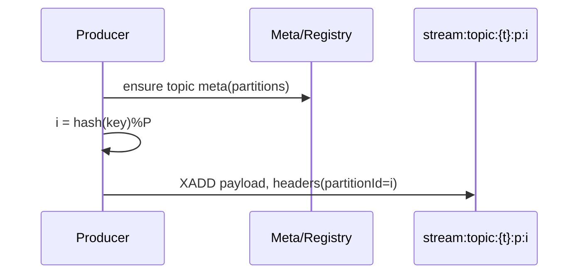
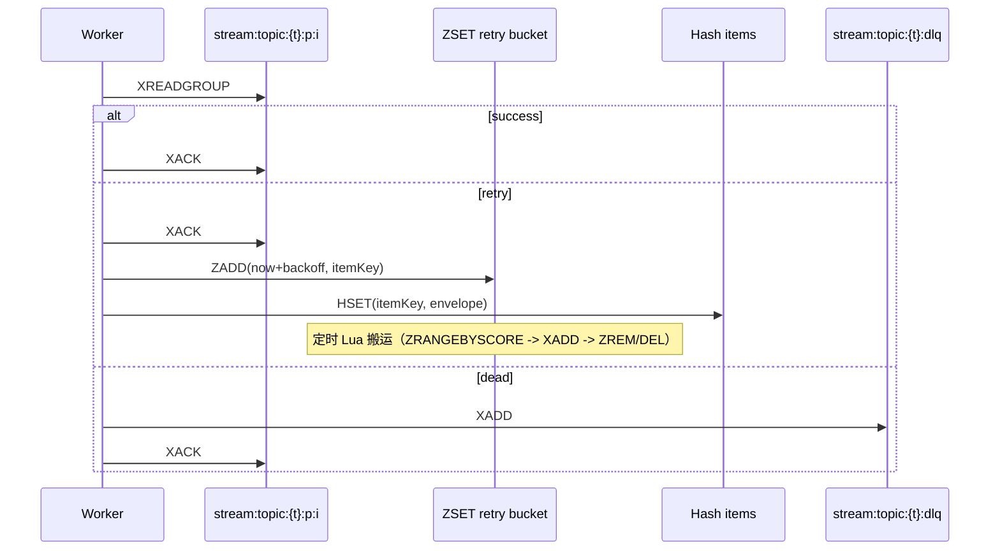
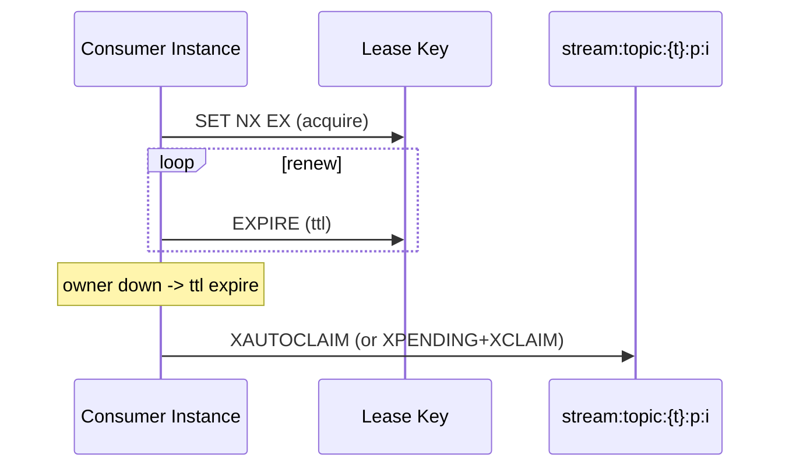

# MQ 与 Redis 交互（Broker Interaction）

本文梳理 MQ 方案用到的 Redis 命令、序列图与用途，便于对照 Kafka 语义理解与排障。

## 核心命令
- 生产写入
  - `XADD stream:topic:{t}:p:{i} * field value …`：往分区流写消息；返回 `timestamp-seq` 形式的 messageId。
- 消费与消费组
  - `XGROUP CREATE <stream> <group> [ID|$|0] [MKSTREAM]`：在流上创建消费组；支持 `MKSTREAM`。
  - `XREADGROUP GROUP <group> <consumer> COUNT n BLOCK ms STREAMS <stream> >`：组内读取消息；支持批量与阻塞超时。
  - `XACK <stream> <group> <id …>`：确认（提交）处理完成，从 Pending 移除。
  - `XPENDING <stream> <group> [start end count [consumer]]`：查询 Pending（未 ack）消息；含空闲时间/投递次数。
- 故障恢复与再均衡
  - `SET key value NX EX ttl` / `EXPIRE key ttl`：以租约确保分区独占；周期续约。
  - `XAUTOCLAIM`（或 `XPENDING+XCLAIM`）：自动认领空闲超时的 Pending（孤儿）消息。
- 延迟重试
  - `ZADD streaming:mq:retry:{t} score member`：将条目按到期时间入重试桶（有序集合）。
  - `ZRANGEBYSCORE` / `ZREM`：扫描/移除到期条目。
  - `HSET streaming:mq:retry:item:{t}:{id} field value …`：存储重试 envelope（JSON 字符串字段）。
  - `EVAL <lua>`：Lua 原子执行“取到期 → XADD 回放 → ZREM → DEL Hash”。
- 死信队列（DLQ）
  - `XADD stream:topic:{t}:dlq * ...`：写入死信；字段含 `originalTopic/partitionId/originalMessageId`。
  - 回放：`XRANGE <dlq> <id> <id>` + `XADD stream:topic:{t}:p:{pid}`。
- 主题治理
  - `XINFO STREAM/GROUPS`：查询流与组信息（长度、last id、组数等）。
  - `XTRIM MAXLEN/MINID`：按长度或按时间（基于 id）清理历史。
  - `DEL <key …>`：删除整条流（谨慎）。

## 生产序列图

## 消费/重试/死信

## 分区独占与接管

## Kafka 对照表
- 生产→分区：`XADD` ≈ Kafka produce to partition
- 消费组与提交：`XREADGROUP`/`XACK` ≈ fetch/commit
- 待处理与位点：`XPENDING` ≈ in-flight（Kafka 侧靠监控/位点推断）
- 再均衡与接管：租约+ `XAUTOCLAIM`/`XCLAIM` ≈ 组协调器/再均衡
- 延迟重试：`ZADD`+Lua 搬运 ≈ 重试主题/延迟回放
- 死信：`stream:topic:{t}:dlq` ≈ DLQ 主题
- 保留：`XTRIM` ≈ retention

