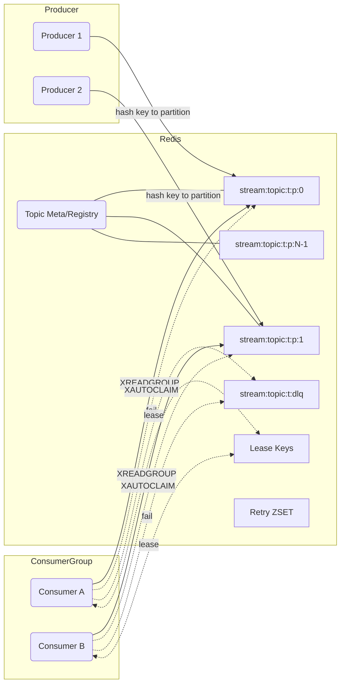

# MQ 设计（分区、重试/DLQ、管理与指标）

本文是 redis-streaming 的消息队列（基于 Redis Streams）设计文档，覆盖：分区、消费组与再均衡、重试与死信、管理与观测。每处均给出设计原因、参考与优缺点，并含有架构图。

## 目标
- 高吞吐、低延迟；可水平扩展（分区 + 消费组）。
- 语义：至少一次（At-Least-Once），可配置重试与死信。
- 鲁棒：自动接管孤儿 pending（XAUTOCLAIM）、租约再均衡、优雅停机。
- 可运维：统一 Topic 注册与元数据、聚合统计、指标与告警。

## 核心概念
- Topic：逻辑主题（对外只有一个名字，如 `orders`）。
- 分区：用于并行的物理 Redis Stream，命名 `stream:topic:{orders}:p:{0..P-1}`。
- 消费组：同一组内分摊负载；不同组互不影响。
- 消费者实例：一个进程可同时消费多个分区。
- 租约：用 Redis 键 + TTL 实现分区独占（同组内同一时刻仅一个实例消费该分区）。
- DLQ：每个 Topic 一个死信流 `stream:topic:{orders}:dlq`。

## 架构图

## 为什么要分区
- 并行度：P 个分区可由多个实例并行处理，总吞吐≈单分区吞吐×P。
- 热点隔离：热点 key 只堵在其分区，不拖慢其他分区。
- Redis Cluster 友好：分区键分散到不同槽位。
- 参考：Kafka 分区设计；Redis Streams 多流消费。
- 代价：扩分区会改变 key→分区映射；更多 worker；再均衡是最终一致。

## 分区元数据与注册表
- `streaming:mq:topics:registry`（Set）：全量 Topic。
- `streaming:mq:topic:{t}:meta`（Hash）：`partitionCount` 等。
- `streaming:mq:topic:{t}:partitions`（Set）：分区流集合。
- 原因：避免 SCAN；便于聚合统计与治理。

## 生产者
- 路由：`partition = hash(key) % P`；headers 写入 `partitionId`；可插拔 Partitioner（RR/一致性哈希）。
- 写入：首次写入确保 meta/registry；XADD 到分区；可选 XTRIM 保留策略。

## 消费组与再均衡
- 语义：同组内“一个分区只被一个实例独占消费”；一个实例可消费多个分区。
- 租约：`streaming:mq:lease:{t}:{g}:{i}` 用 `SET NX EX` 获取，周期 EXPIRE 续约；过期即失效。
- 接管：所有权变化时，对孤儿 pending 用 `XAUTOCLAIM` 以 idle 阈值接回。
- Worker：每分区一个串行 Worker；独立调度线程池做续约、XAUTOCLAIM、指标采集、延迟重试回放。

## 重试与 DLQ
- 至少一次：失败可重试；超过阈值入 DLQ。
- 策略：`RetryPolicy`（最大次数、退避策略、是否重投/延迟、最大延迟）；`DeadLetterPolicy`（字段规范与回放）。
- 实现（默认）：ACK 原消息 + 以 `retryCount+1` 重新 XADD（新 ID），并通过 ZSET 延迟回放到原分区；终止失败发到 `stream:topic:{t}:dlq`。
- 优点：行为确定、可观测；避免热循环；
- 缺点：重试生成新 ID；需要回放任务。

## 管理与观测
- 统计：按 topic 跨分区聚合（length 求和、first/lastId 聚合、lag≈Σ(lastId−groupLastDeliveredId)）。
- Pending 明细：跨分区合并分页；支持按 idle/次数排序。
- 维护：XTRIM 长度清理；按时间基于 ID 边界删除；再均衡视图（分区→所有者）。
- 指标：计数器（produce/consume/ack/retry/DLQ）、仪表（topicLength/pending/inflight/partitionsOwned）、计时（处理/ack 延迟）；标签包含 topic、partitionId、group、consumerId、result。

## 与 Kafka 的关系
- 语义等价：分区/组独占/再均衡/lag 聚合；只是协调机制换成 Redis 键 + XAUTOCLAIM。
- 优点：无需外部协调器；易于部署。
- 局限：最终一致的租约；Redis 内存与网络开销。

## 参考
- Redis Streams：XADD/XREADGROUP/XACK/XPENDING/XAUTOCLAIM/XTRIM。
- Kafka：分区与消费组设计。
- 退避：指数退避 + 抖动（AWS 架构博客）。

更多序列图、优缺点与取舍细节见 `docs/redis-mq-design.md`。

## Redis 命令与 Kafka 语义对照

以下列出 MQ 方案中使用到的核心 Redis 命令、用途说明，以及与 Kafka 功能的对应关系（便于迁移或理解语义）：

- 生产写入（Kafka Producer → 发送到分区）
  - `XADD stream:topic:{t}:p:{i} * field value …`
    - 作用：往指定分区流追加一条消息，返回自增的消息 ID（`timestamp-seq`）。
    - Kafka 映射：Producer 发送到某个 Topic 的 Partition（Kafka 由 broker 分配 offset；Redis 由流生成 messageId）。

- 消费与消费组（Kafka Consumer/Group → 拉取/提交）
  - `XGROUP CREATE <stream> <group> [ID|$|0] [MKSTREAM]`
    - 作用：在流上创建消费者组；`MKSTREAM` 在流不存在时自动创建。
    - Kafka 映射：`--group` 创建消费组（协调器维护组元数据）。
  - `XREADGROUP GROUP <group> <consumer> COUNT n BLOCK ms STREAMS <stream> >`
    - 作用：组内消费未投递过的消息（或用具体 ID 读取 pending）；支持批量与阻塞超时。
    - Kafka 映射：`FetchRequest` 拉取消息；`COUNT/BLOCK` 对应 `max.poll.records/poll timeout`。
  - `XACK <stream> <group> <id ...>`
    - 作用：确认（提交）已处理消息，从 Pending 列表移除。
    - Kafka 映射：提交位点（`commitSync/commitAsync`）。
  - `XPENDING <stream> <group> [start end count [consumer]]`
    - 作用：查询 Pending（未 ack）消息（队列/消费者维度），含空闲时长、投递次数等。
    - Kafka 映射：相当于“组内未提交的 in-flight 记录”查询（Kafka 没有等价命令，但在监控/位点上可见）。

- 故障恢复与再均衡（Kafka Rebalance/Coordinator → 分区独占与接管孤儿）
  - `SET key value NX EX ttl` / `EXPIRE key ttl`
    - 作用：以租约（Lease）实现分区独占；同组内一个分区只被一个消费者持有；周期续约。
    - Kafka 映射：组协调器分配分区给消费者实例；`heartbeat` 维持会话。
  - `XAUTOCLAIM <stream> <group> <consumer> <min-idle-time> <start> [COUNT n]`（部分环境用 `XCLAIM` 替代）
    - 作用：自动认领空闲超时的 Pending（孤儿）消息，迁移到当前消费者并返回条目；我们的实现用 `listPending + claim` 兼容。
    - Kafka 映射：再均衡后接管分区，继续从最新/指定位点消费（这里接管的是未确认的消息）。

- 重试与延迟（Kafka 重试主题/退避 → Redis 延迟桶 + 回放）
  - `ZADD streaming:mq:retry:{t} score member`
    - 作用：将待重试条目按到期时间投放到有序集合（score=dueAt）。
    - Kafka 映射：将失败消息发到重试主题并按延迟分桶（常见的延迟重试实现）。
  - `ZRANGEBYSCORE ... / ZREM ...`
    - 作用：批量拉取到期重试条目并从桶中移除。
  - `HSET streaming:mq:retry:item:{t}:{id} field value ...`（配合 Lua 原子搬运）
    - 作用：将重试 envelope（topic/partitionId/payload/headers/retryCount/...）放入 Hash，Lua 一次性读取并回放。
  - `EVAL <lua> ...`
    - 作用：Lua 脚本原子执行“取到期→XADD 回分区→ZREM→DEL Hash”的搬运过程，减少丢失窗口，保障至少一次。
    - Kafka 映射：重试主题消费端把消息再投回主主题（延迟重试），常用调度器或流式处理框架实现。

- 死信（Kafka DLQ → Redis DLQ 流）
  - `XADD stream:topic:{t}:dlq * field value ...`
    - 作用：将超出重试上限或标记 DEAD 的消息写入 DLQ 流，包含 originalTopic/partitionId/originalMessageId 等。
    - Kafka 映射：每个 Topic 一个死信 Topic；DLQ 消费端可人工介入或自动回放。
  - 回放：`XRANGE <dlq> <id> <id>` + `XADD stream:topic:{t}:p:{pid}`
    - 作用：按 DLQ 记录的 partitionId 回放到原分区（或指定分区）。
    - Kafka 映射：DLQ 消息回放到原 Topic/Partition。

- 主题治理（Kafka Topic 管理/保留/删除 → Redis 管理）
  - `XINFO STREAM <stream>` / `XINFO GROUPS <stream>`
    - 作用：查询流信息（长度、last id、组数…）与组统计（消费者数、pending、last-delivered-id）。
    - Kafka 映射：Topic 元数据、各分区 lag/consumer 数量等。
  - `XTRIM <stream> MAXLEN ~ N` / `XTRIM <stream> MINID <id>`
    - 作用：按长度或时间（基于 id）裁剪历史，控制内存与保留窗口。
    - Kafka 映射：基于大小/时间的保留策略（retention.bytes/retention.ms）。
  - `DEL <key ...>`
    - 作用：删除整个流（慎用，会丢数据）。
    - Kafka 映射：删除 Topic。

提示
- Redisson 的 API 封装了 `XINFO/XPENDING/...` 等原生命令；文档列出的是底层 Redis 命令，便于对照 Kafka 语义理解。
- 如果 Redis 版本不支持 `XAUTOCLAIM`，可用 `XPENDING + XCLAIM` 组合完成孤儿接管（效率略低）。
