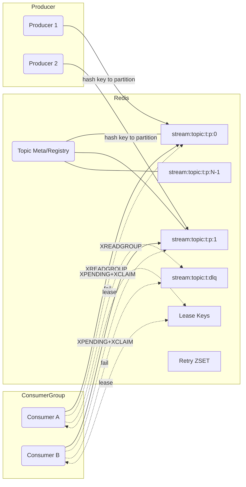

# MQ 设计（分区、重试/DLQ、管理与指标）

本文是 `mq/` 模块（基于 Redis Streams 的消息队列）设计文档，覆盖：分区、消费组与再均衡、重试与死信、管理与观测。类名、方法名、键名与默认值均以 `mq/src/main/java` 为准；Redis 命令级交互见 [MQ-Broker-Interaction.md](./MQ-Broker-Interaction.md)。

## 目标

- 高吞吐、低延迟；可水平扩展（分区 + 消费组）。
- 语义：至少一次（At-Least-Once），可配置重试与死信。
- 鲁棒：孤儿 pending 自动接管（`XPENDING + XCLAIM`）、租约再均衡、优雅停机。
- 可运维：统一 Topic 注册与元数据、聚合统计、可插拔指标。

## 核心概念

- Topic：逻辑主题（对外只有一个名字，如 `orders`）。
- 分区：用于并行的物理 Redis Stream，键名 `{streamKeyPrefix}:{topic}:p:{i}`（默认 `stream:topic:orders:p:{0..P-1}`）。
- 消费组：同组内分摊负载；不同组互不影响。
- 消费者实例：一个进程可同时租约多个分区（上限 `maxLeasedPartitionsPerConsumer`，0 表示取 `workerThreads`）。
- 租约：Redis 字符串键 + TTL 实现分区独占（同组内同一时刻仅一个实例消费该分区）。
- DLQ：每个 Topic 一个死信流 `{streamKeyPrefix}:{topic}:dlq`。

## 架构图

```mermaid
flowchart LR
  subgraph Producer
    P1(Producer 1)
    P2(Producer 2)
  end
  subgraph Redis
    direction TB
    META(Topic Meta/Registry)
    P0[stream:topic:t:p:0]
    P1s[stream:topic:t:p:1]
    PNs[stream:topic:t:p:N-1]
    DLQ[stream:topic:t:dlq]
    LEASE[Lease Keys]
    RETRY[Retry ZSET]
  end
  subgraph ConsumerGroup
    C1(Consumer A)
    C2(Consumer B)
  end
  P1 -->|hash key to partition| P0
  P2 -->|hash key to partition| P1s
  C1 -->|XREADGROUP| P0
  C2 -->|XREADGROUP| P1s
  C1 -.XPENDING+XCLAIM.-> P0
  C2 -.XPENDING+XCLAIM.-> P1s
  C1 -.fail.-> DLQ
  C2 -.fail.-> DLQ
  C1 <-.lease.-> LEASE
  C2 <-.lease.-> LEASE
  META --- P0
  META --- P1s
  META --- PNs
```

## 为什么要分区

- 并行度：P 个分区可由多个实例并行处理，总吞吐上限随分区数扩展。
- 热点隔离：热点 key 只堵在其分区，不拖慢其他分区。
- Redis Cluster 友好：分区键分散到不同槽位。
- 代价：扩分区会改变 key→分区映射（`updatePartitionCount` 只允许增大，不改写已投递消息）；更多 Worker；再均衡是最终一致。

## 分区元数据与注册表

- `{keyPrefix}:topics:registry`（Set）：全量 Topic（`TopicRegistry`，避免 `KEYS/SCAN`）。
- `{keyPrefix}:topic:{t}:meta`（Hash）：字段 `partitionCount`（`TopicPartitionRegistry`）。
- `{keyPrefix}:topic:{t}:partitions`（Set）：分区流键集合。
- meta 缺失或不可解析时分区数回退为 1。

## 生产者

- 路由：默认 `HashPartitioner`（`String.hashCode() % P`，key 为 null 时随机）；`Partitioner` 是单方法接口，可替换实现（当前仓库内只有 Hash 这一种实现，无 RR/一致性哈希实现）。
- 强制分区：header `x-force-partition-id`（`MqHeaders.FORCE_PARTITION_ID`）由 `HashBrokerRouter` 与生产路径尊重；DLQ 回放靠它回到原分区。
- 写入（`RedisBrokerPersistence.append`）：首次写入注册 Topic 与 meta；条目字段统一序列化为字符串后经 Lua `XADD ... MAXLEN = N` 原子追加并按 `retentionMaxLenPerPartition` 精确裁剪（`=` 为精确语义，Redis 7+；旧版本回退近似 `XTRIM` + 分页 `XDEL` 硬上限）。
- Broker 抽象：`Broker = BrokerRouter（选分区） + BrokerPersistence（落盘）`，经 `BrokerFactory` 组装；默认 `RedisBrokerFactory`，另有 `JdbcBrokerFactory`（MySQL 表 `rs_messages`，仅实现生产 `append`，读取仍走 Redis 流语义）。

## 消费组与再均衡

- 语义：同组内「一个分区只被一个实例独占消费」；一个实例可消费多个分区。
- 组创建：`subscribe` 用 Lua 保证幂等——先 `XINFO GROUPS` 检查，再 `XGROUP CREATE <stream> <group> 0-0 MKSTREAM`，`BUSYGROUP` 视为已存在。因为建组位点为 `0-0`，组创建前的 backlog 也会投递（`>` 只表示「未投递给本组」）。
- 租约（`lease.LeaseManager`）：获取用 `SET NX EX`（原子，崩溃不会留下无 TTL 键）；续约与释放用 Lua「值等于本人 id 才 `PEXPIRE`/`DEL`」，避免误删继任者的新租约。键 `{keyPrefix}:lease:{t}:{g}:{i}`。
- 接管：调度线程按 `pendingScanIntervalSec` 对本人持有的分区执行 `XPENDING`（Redisson `listPending`），对 idle 超过 `claimIdleMs` 的条目执行 `XCLAIM`（Redisson `claim`）接回并重放 handler。实现不使用 `XAUTOCLAIM`。
- Worker：每分区一个串行 Worker（`consumerPool`）；独立调度线程池（`schedulerPool`）做再均衡（`rebalanceIntervalSec`）、续约（`renewIntervalSec`）、pending 扫描、延迟重试搬运（`retryMoverIntervalSec`）。
- 并发上限：`maxInFlight > 0` 时用信号量限制单实例并发处理（MQ-08：停止时未配对的 permit 不释放，避免配额永久缩水）；`maxLeasedPartitionsPerConsumer` 限制单实例活跃分区数。
- 订阅级过滤：`SubscriptionOptions.partitionModulo/partitionRemainder` 让实例只接管 `i % mod == rem % mod` 的分区。

## 重试与 DLQ

- 至少一次：失败可重试；超过上限入 DLQ。
- 策略接口 `retry.RetryPolicy` 只有两个方法：`getMaxAttempts()` 与 `nextBackoffMs(attempt)`；内置 `ExponentialBackoffRetryPolicy`（`baseMs * 2^(n-1)` 封顶 `maxBackoffMs`，移位按 62 饱和防溢出）。仓库内不存在 `DeadLetterPolicy` 类；「失败进 DLQ」的规则硬编码在消费路径。
- 实际重试上限 = `min(message.maxRetries, retryPolicy.maxAttempts)`；`Message` 默认 `maxRetries=3`（构造器），`retryMaxAttempts` 默认 5。
- 失败路径（`RETRY`）：
  1. 记录 `x-original-message-id`（重试产生新 stream id，原始 id 保留用于关联/去重）；
  2. 退避 ≤ 50ms：直接用新 id 重投分区流；
  3. 否则写重试 Hash `{keyPrefix}:retry:item:{t}:{uuid}`（字段 topic/partitionId/payload/key/headers/retryCount/maxRetries/originalMessageId）+ 重试 ZSET `{keyPrefix}:retry:{t}`（score=到期时间戳）；
  4. 搬运线程持 `streaming:mq:retry:lock:{t}` 锁，Lua 原子执行「`ZRANGEBYSCORE` 取到期 → `XADD` 回分区 → `ZREM` → `DEL` Hash」，每轮至多 `retryMoverBatch` 条；
  5. 入队成功后才 ACK 原消息（顺序相反会丢消息）。
- 终止失败（`FAIL`/`DEAD_LETTER`/重试耗尽）：组装 `DeadLetterRecord` 写 `{streamKeyPrefix}:{t}:dlq`（字段 originalTopic/payload/timestamp/failedAt/retryCount/partitionId/headers/originalMessageId/maxRetries），DLQ 写成功才 ACK；写失败保持 pending 待重投。
- 毒消息处理（MQ-06）：解析失败（时间戳损坏、payload 引用丢失等）直接进 DLQ 并 ACK，避免无限重认领；头部带 `x-payload-missing` / `x-payload-missing-ref`。
- 优点：行为确定、可观测、避免热循环；缺点：重试生成新 ID；延迟重试需要搬运任务。

## ACK 与删除策略

`MqOptions.ackDeletePolicy`（默认 `none`）由 `DefaultBroker.ack` 执行：

- `none`：仅 `XACK`，条目留在流中，靠保留策略清理。
- `immediate`：`XACK` 后 `XDEL`（只对单组消费安全）。
- `all-groups-ack`：把组名 `SADD` 到 `{keyPrefix}:acks:{t}:p:{i}:{id}`（TTL `acksetTtlSec`）；当 ack 集合覆盖「已注册消费组数」（`XINFO GROUPS` 计数，含已停止的组——MQ-04：注册的组是投递契约，不能用存活租约数）时 `XDEL` 并删集合。

## 提交位点（commit frontier）

- ACK 后以 Lua 原子维护 `{keyPrefix}:commit:{t}:p:{i}`（Hash，field=组，value=已确认的最大 stream id，MQ-11）：只有新 id 更大才 `HSET`，消除并发 ack worker 的读后写回退；存储值剥离引号后按 `ms-seq` 比较，非 stream id 的存量值会被覆盖（自愈）。
- 位点目前是观测/运维信息（Admin 的组统计使用 `XINFO` 的 last-delivered-id），不参与消费起点决策。

## 大 payload 生命周期（`impl.PayloadLifecycleManager`）

- 阈值：`PayloadHeaders.MAX_INLINE_PAYLOAD_SIZE = 64KB`，超过则 payload JSON 转存 `{keyPrefix}:payload:{t}:p:{i}:{uuid}`，流内 header 持 `x-payload-hash-ref` / `x-payload-storage-type=hash`。
- 主删除路径是 ACK（`deletePayloadHashFromStreamData`）；另有索引兜底清理：按 Topic 的 Set `{keyPrefix}:payload:idx:{t}`（`cleanupTopicPayloadHashes`，`deleteTopic` 会调用）与全局时间 ZSET `{keyPrefix}:payload:ts`（`cleanupOrphanedPayloadHashes`）。
- 若配置了 `retentionMs > 0`，payload 键以该值为 TTL 上限；默认 0（无 TTL，优先 ACK 删除）。
- DLQ 回放时若引用仍在，则续期/重存引用；引用丢失则打 `x-payload-missing` 标记照常回放。

## 管理与观测

- 统计：`RedisMessageQueueAdmin` 按 topic 跨分区聚合（length 求和、first/lastId 聚合、组数取最大）；lag 近似为各分区 `lastId` 与组 `last-delivered-id` 时间戳部分之差。
- Pending 明细：跨分区采样（每分区 ≤ 200）合并排序，支持按 idle/投递次数/ID 排序与 `minIdleMs` 过滤。
- 维护：`trimQueue`（长度，均摊到分区）/`trimQueueByAge`（按时间，分页扫描 `XDEL`，页大小系统属性 `mq.admin.test.trimAgePageSize` 默认 500）；`deleteTopic`（分区流/DLQ/meta/分区集合/负载 hash + 移出注册表）；`resetConsumerGroupOffset`（删除并按 `0-0`/`$`/指定 id 重建组）；`updatePartitionCount`（只增）。
- 指标（`metrics.MqMetricsCollector`，默认 Noop；starter 提供 Micrometer 实现）：计数 `incProduced/incConsumed/incAcked/incRetried/incDeadLetter/incPayloadMissing/incDlqDelete/incDlqClear`，仪表 `setInFlight/setEligiblePartitions/setLeasedPartitions/setMaxLeasedPartitions`，计时 `recordHandleLatency/recordBackpressureWait/recordDlqReplay`；保留裁剪经 `RetentionMetricsCollector.recordTrim/recordDlqTrim`。标签含 topic、partitionId、consumerName、group。

## 保留策略（retention）

- 长度：`retentionMaxLenPerPartition`（默认 100000）在写入路径原子执行（`XADD ... MAXLEN = N`）。
- 时间：`retentionMs`、`dlqRetentionMs` 与周期 `trimIntervalSec` 由 spring-boot-starter 的 `StreamRetentionHousekeeper` 后台任务消费（`XTRIM MAXLEN ~` / `XTRIM MINID ~`）；mq 模块自身不用这两个值做裁剪（`retentionMs` 仅作为 payload TTL 上限）。
- DLQ 长度覆盖 `dlqRetentionMaxLen`（默认 0=未启用）同样只被 starter housekeeper 消费。

## 与 Kafka 的关系

- 语义对应：分区 / 组内独占 / 再均衡 / lag 聚合；协调机制换成 Redis 键 + `XPENDING+XCLAIM`。
- 优点：无需外部协调器；易于部署。
- 局限：租约最终一致；Redis 内存与网络开销。

## Redis 命令与 Kafka 语义对照

以下列出实现实际使用到的核心 Redis 命令及与 Kafka 功能的对应关系（Redisson 已封装原生命令，此处列底层命令便于对照与排障）：

- 生产写入（Kafka Producer → 发送到分区）
  - `XADD stream:topic:{t}:p:{i} * field value …`：追加消息，返回 `timestamp-seq` 形式的 id；保留策略启用时为 `XADD ... MAXLEN = N`。
  - Kafka 映射：Producer 发送到 Topic 的 Partition（Kafka 分配 offset；Redis 由流生成 id）。

- 消费与消费组（Kafka Consumer/Group → 拉取/提交）
  - `XGROUP CREATE <stream> <group> 0-0 MKSTREAM`（subscribe 与 Broker 读路径均以 Lua 保证幂等，吞 `BUSYGROUP`）。
  - `XREADGROUP GROUP <g> <c> COUNT n BLOCK ms STREAMS <stream> >`：从未投递条目读取；对应 Kafka fetch。
  - `XACK <stream> <group> <id ...>`：确认，从 PEL 移除；对应 commit。
  - `XPENDING <stream> <group>`（Redisson `listPending`）：查询未 ack 条目（idle、投递次数）；Kafka 无直接等价，靠位点/监控推断。

- 故障恢复与再均衡（Kafka Rebalance/Coordinator → 分区独占与接管孤儿）
  - `SET key value NX EX ttl`：获取分区租约；Lua「比对本人 id 后 `PEXPIRE`/`DEL`」实现续约与释放。
  - `XCLAIM <stream> <group> <consumer> <min-idle-time> <id>`：认领空闲超时的 pending（实现通过 `listPending + claim` 组合；未使用 `XAUTOCLAIM`）。
  - Kafka 映射：组协调器分配分区 + heartbeat 维持会话；再均衡后接管未确认消息。

- 延迟重试（Kafka 重试主题/退避 → Redis 延迟桶 + Lua 搬运）
  - `ZADD streaming:mq:retry:{t} <dueAtMs> <itemKey>`：按到期时间入桶。
  - `HSET streaming:mq:retry:item:{t}:{uuid} topic ... partitionId ... payload ... key ... headers ... retryCount ... maxRetries ... originalMessageId ...`：多字段字符串 envelope（payload/headers 为 JSON 编码；null payload 不写该字段）。
  - `EVAL <lua>`：持锁原子执行「`ZRANGEBYSCORE` 取到期 → `XADD` 回分区 → `ZREM` → `DEL` Hash」。
  - Kafka 映射：重试主题按延迟分桶后回投主主题。

- 死信（Kafka DLQ → Redis DLQ 流）
  - `XADD stream:topic:{t}:dlq * ...`：字段含 `originalTopic / partitionId / originalMessageId / retryCount / maxRetries / timestamp / failedAt / headers / payload`。
  - 回放：`XRANGE <dlq> <id> <id>` 读出后按 `partitionId`（或 `x-force-partition-id`）`XADD` 回原分区；回放不自动 `XDEL` DLQ 条目。

- 主题治理（Kafka Topic 管理/保留/删除 → Redis 管理）
  - `XINFO STREAM / XINFO GROUPS`（Redisson `getInfo`/`listGroups`）：流与组统计。
  - `XTRIM MAXLEN = N`（写入路径，精确）/ `XTRIM MAXLEN ~ N`、`XTRIM MINID <id>`（starter housekeeper 周期执行）/ 分页 `XDEL`（`trimQueueByAge`、硬上限兜底）。
  - `DEL <key ...>`：`deleteTopic` 删除分区流/DLQ/meta 等（慎用，丢数据）。

## 参考

- Redis Streams：XADD / XREADGROUP / XACK / XPENDING / XCLAIM / XTRIM / XDEL。
- Kafka：分区与消费组设计。
- 命令级交互与序列图：[MQ-Broker-Interaction.md](./MQ-Broker-Interaction.md)。
- 配置项全表：[MQ.md](./MQ.md)。
