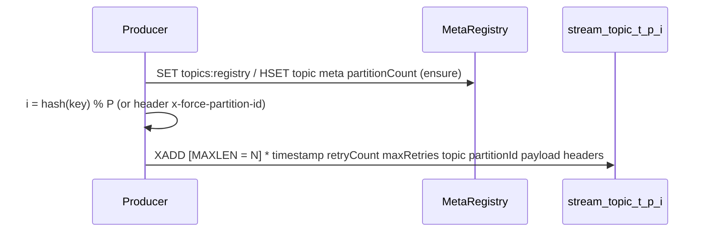
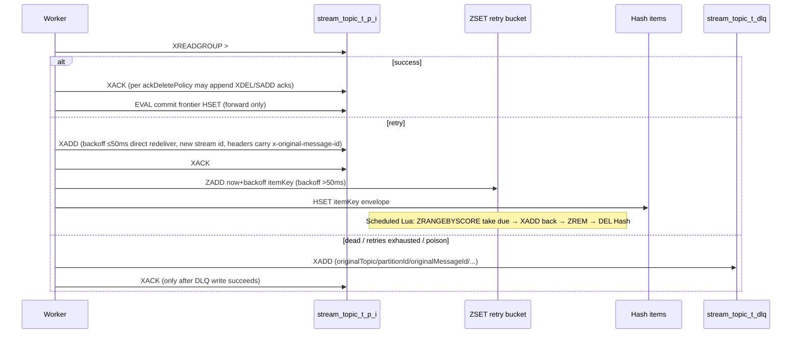
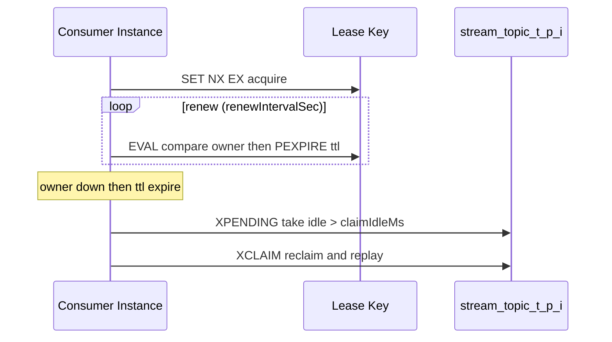

# MQ Broker Interaction

[中文](../MQ-Broker-Interaction.md) | [English](MQ-Broker-Interaction-en.md)

---

This document catalogs the Redis commands actually used by the `mq/` module, with sequence diagrams and Kafka semantic mappings, to aid understanding and troubleshooting. The command list has been verified against `mq/src/main/java`; implementation goes through Redisson APIs (`RStream`/`RScript`/`RBucket` etc.), and the tables below show the corresponding raw commands.

Key conventions: control key prefix `keyPrefix` (default `streaming:mq`), data stream prefix `streamKeyPrefix` (default `stream:topic`), see `partition/StreamKeys`.

## Core Commands

### Produce
- `XADD stream:topic:{t}:p:{i} [MAXLEN = N] * field value …`: write message to partition stream; returns `timestamp-seq` messageId. When `retentionMaxLenPerPartition > 0`, Lua atomically executes `XADD ... MAXLEN = N` (`=` exact trim, Redis 7+; older versions fall back to `XADD` + `XTRIM` + paged `XDEL` safety net).

### Consumer Group
- `XGROUP CREATE <stream> <group> 0-0 MKSTREAM`: create consumer group (`subscribe` and `DefaultBroker.readGroup` both check `XINFO GROUPS` via Lua first, swallow `BUSYGROUP`). Group created at `0-0`, so backlog before group creation is also delivered.
- `XREADGROUP GROUP <group> <consumer> COUNT n BLOCK ms STREAMS <stream> >`: read undelivered entries within group (Redisson `StreamReadGroupArgs.neverDelivered()`).
- `XACK <stream> <group> <id …>`: acknowledge processing complete, remove from PEL.
- `XPENDING <stream> <group> <start> <end> <count>` (Redisson `listPending`): query unacked entries (idle, delivery count).
- `XCLAIM <stream> <group> <consumer> <min-idle-time> <id>` (Redisson `claim`): claim pending entries idle > `claimIdleMs`. Implementation uses `listPending + claim` combo; does not use `XAUTOCLAIM`.

### ACK Delete Policy (`MqOptions.ackDeletePolicy`, default `none`)
- `immediate`: `XACK` then `XDEL` (safe only for single-group consumption).
- `all-groups-ack`: `SADD streaming:mq:acks:{t}:p:{i}:{id} <group>` (TTL `acksetTtlSec`); when set size ≥ `XINFO GROUPS` registered group count, `XDEL` and delete set.

### Commit Frontier
- `EVAL <lua>`: after ACK, atomically maintains `streaming:mq:commit:{t}:p:{i}` (Hash, field=group) — only `HSET` when new id (ms-seq compare) exceeds stored value.

### Failure Recovery & Rebalance
- `SET streaming:mq:lease:{t}:{g}:{i} <consumerId> NX EX <ttl>`: acquire partition lease.
- `EVAL <lua>`: renew (compare owner id then `PEXPIRE`) and release (compare owner id then `DEL`), prevents deleting successor's lease.

### Delayed Retry
- `ZADD streaming:mq:retry:{t} <dueAtMs> <itemKey>`: entry enters retry bucket by due time (sorted set).
- `HSET streaming:mq:retry:item:{t}:{uuid} topic ... partitionId ... payload ... key ... headers ... retryCount ... maxRetries ... originalMessageId ...`: multi-field string envelope; `payload`/`headers` JSON-encoded; null payload omits `payload` field.
- Distributed lock `streaming:mq:retry:lock:{t}` (Redisson `RLock`, wait `retryLockWaitMs`, lease `retryLockLeaseMs`): serializes mover per Topic. Note this key is a literal constant, does not vary with `keyPrefix`.
- `EVAL <lua>`: atomically executes "ZRANGEBYSCORE take due (≤ `retryMoverBatch`) → XADD back to partition → ZREM → DEL Hash".

### Dead Letter Queue (DLQ)
- `XADD stream:topic:{t}:dlq * ...`: dead letter fields include `originalTopic / partitionId / originalMessageId / retryCount / maxRetries / timestamp / failedAt / headers / payload`.
- Replay: `XRANGE <dlq> <id> <id>` reads entries, then `XADD stream:topic:{t}:p:{pid}` back to original partition by `partitionId`; replay does not auto-`XDEL` DLQ entries.

### Topic Governance
- `XINFO STREAM / XINFO GROUPS`: query stream info (length, last id, group count) and group stats (consumer count, pending, last-delivered-id).
- `XTRIM MAXLEN = N` / `XTRIM MAXLEN ~ N` / `XTRIM MINID <id>`: trim by length or time. Write path uses exact `MAXLEN =`; periodic `MAXLEN ~` / `MINID ~` run by spring-boot-starter's `StreamRetentionHousekeeper` per `trimIntervalSec`.
- `DEL <key …>`: `deleteTopic` removes partition streams, DLQ, meta, partition set, and Topic's payload keys (caution: data loss).

### Large Payload (> 64KB, `PayloadHeaders.MAX_INLINE_PAYLOAD_SIZE`)
- `SET streaming:mq:payload:{t}:p:{i}:{uuid} <json>`: stream only keeps header `x-payload-hash-ref` reference.
- ACK triggers `DEL` of that key (primary deletion path); index `streaming:mq:payload:idx:{t}` (Set) and `streaming:mq:payload:ts` (ZSET) provide fallback cleanup.

## Produce Sequence

```mermaid
sequenceDiagram
  participant P as Producer
  participant M as MetaRegistry
  participant S as stream_topic_t_p_i
  P->>M: SET topics:registry / HSET topic meta partitionCount (ensure)
  P->>P: i = hash(key) % P (or header x-force-partition-id)
  P->>S: XADD [MAXLEN = N] * timestamp retryCount maxRetries topic partitionId payload headers
```

## Consume / Retry / Dead Letter

```mermaid
sequenceDiagram
  participant W as Worker
  participant S as stream_topic_t_p_i
  participant RB as ZSET retry bucket
  participant RH as Hash items
  participant DL as stream_topic_t_dlq
  W->>S: XREADGROUP >
  alt success
    W->>S: XACK (per ackDeletePolicy may append XDEL/SADD acks)
    W->>S: EVAL commit frontier HSET (forward only)
  else retry
    W->>S: XADD (backoff ≤50ms direct redeliver, new stream id, headers carry x-original-message-id)
    W->>S: XACK
    W->>RB: ZADD now+backoff itemKey (backoff >50ms)
    W->>RH: HSET itemKey envelope
    Note over RB: Scheduled Lua: ZRANGEBYSCORE take due → XADD back → ZREM → DEL Hash
  else dead / retries exhausted / poison
    W->>DL: XADD (originalTopic/partitionId/originalMessageId/...)
    W->>S: XACK (only after DLQ write succeeds)
  end
```

## Lease & Reclaim

```mermaid
sequenceDiagram
  participant C as Consumer Instance
  participant L as Lease Key
  participant S as stream_topic_t_p_i
  C->>L: SET NX EX acquire
  loop renew (renewIntervalSec)
    C->>L: EVAL compare owner then PEXPIRE ttl
  end
  Note over C: owner down then ttl expire
  C->>S: XPENDING take idle > claimIdleMs
  C->>S: XCLAIM reclaim and replay
```

## Kafka Mapping Table

- Produce → Partition: `XADD` ≈ Kafka produce to partition
- Consume Group & Commit: `XREADGROUP`/`XACK` ≈ fetch/commit
- Pending & Offset: `XPENDING` ≈ in-flight (Kafka side infers from lag/offset)
- Rebalance & Reclaim: Lease + `XPENDING`+`XCLAIM` ≈ Group coordinator / rebalance
- Delayed Retry: `ZADD`+Hash + Lua mover ≈ Retry topic / delayed replay
- Dead Letter: `stream:topic:{t}:dlq` ≈ DLQ topic
- Retention: `XADD ... MAXLEN =` / `XTRIM` ≈ retention

## Notes

- Redisson APIs wrap `XINFO/XPENDING/XCLAIM/...` raw commands; this doc lists raw commands for Kafka semantic cross-reference.
- Orphan reclaim uses `listPending + claim` (`XCLAIM`), not `XAUTOCLAIM`, so it works on older Redis versions lacking `XAUTOCLAIM`.

---

**Version**: 0.2.0
**Last Updated**: 2026-10-05