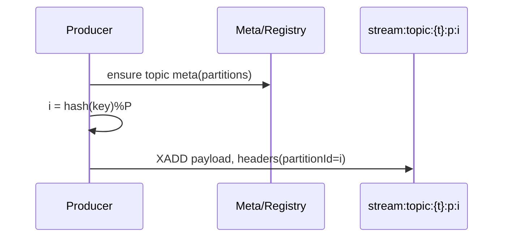
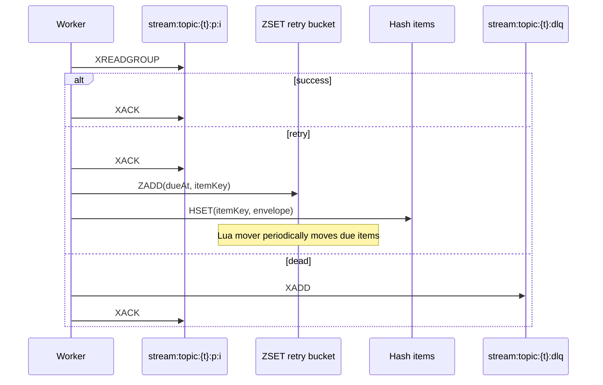
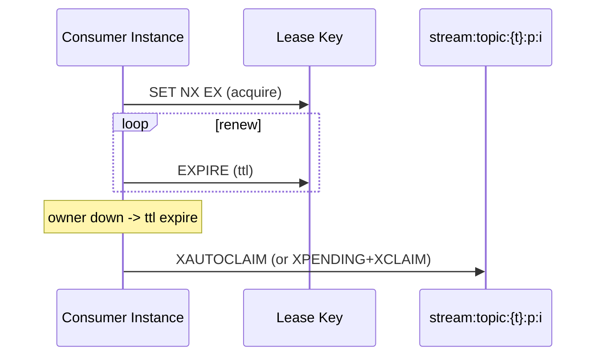

# MQ Broker Interaction

This page captures Redis commands, sequences and purposes used by the MQ subsystem.

## Commands
- Produce
  - `XADD stream:topic:{t}:p:{i} * field value …`: append to partition stream; returns `timestamp-seq` id.
- Consume & Groups
  - `XGROUP CREATE <stream> <group> [ID|$|0] [MKSTREAM]`: create group on stream.
  - `XREADGROUP GROUP <group> <consumer> COUNT n BLOCK ms STREAMS <stream> >`: read messages in a group.
  - `XACK <stream> <group> <id …>`: acknowledge entries (commit), remove from PEL.
  - `XPENDING <stream> <group> [start end count [consumer]]`: inspect pending entries.
- Recovery & Rebalance
  - `SET key value NX EX ttl` / `EXPIRE key ttl`: leases for exclusive partition ownership.
  - `XAUTOCLAIM` (or `XPENDING+XCLAIM`): reclaim orphan (idle) pending entries.
- Delayed Retry
  - `ZADD streaming:mq:retry:{t} score member`: schedule retry items by due time.
  - `ZRANGEBYSCORE` / `ZREM`: fetch/remove due items.
  - `HSET streaming:mq:retry:item:{t}:{id} field value …`: store retry envelope as JSON strings.
  - `EVAL <lua>`: atomically move due items: ZRANGEBYSCORE -> XADD -> ZREM -> DEL.
- Dead Letters (DLQ)
  - `XADD stream:topic:{t}:dlq * ...`: write dead letters with originalTopic/partitionId/originalMessageId.
  - Replay: `XRANGE <dlq> <id> <id>` + `XADD stream:topic:{t}:p:{pid}`.
- Topic Governance
  - `XINFO STREAM/GROUPS`: inspect stream/group stats.
  - `XTRIM MAXLEN/MINID`: retention by length or time (id-based).
  - `DEL <key …>`: delete stream (use with caution).

## Produce

## Consume / Retry / Dead Letter

## Leases & Orphan Reclaim

## Kafka Mapping
- Produce→partition: `XADD` ≈ Kafka produce
- Groups & commit: `XREADGROUP`/`XACK` ≈ fetch/commit
- PEL/in-flight: `XPENDING` ≈ in-flight
- Rebalance & reclaim: leases + `XAUTOCLAIM`/`XCLAIM` ≈ coordinator/rebalance
- Delayed retry: `ZADD` + Lua mover ≈ retry topics
- Dead letters: `stream:topic:{t}:dlq` ≈ DLQ topics
- Retention: `XTRIM` ≈ retention
