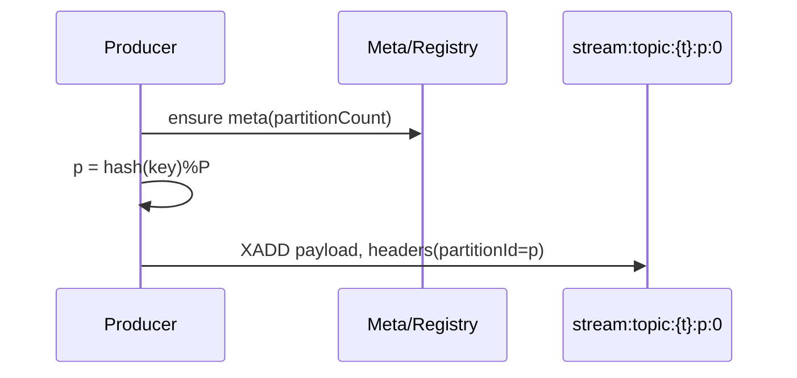
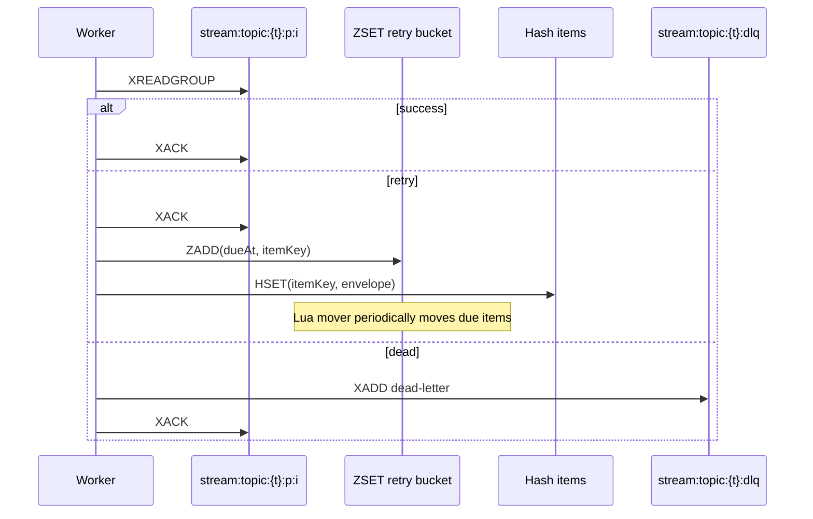

# MQ Design (Redis Streams)

This page describes the partitioned, group-based MQ built on Redis Streams, with leases-based exclusive partition ownership, delayed retries (ZSET + Lua), DLQ, admin aggregation, and metrics. It mirrors Kafka semantics while staying Redis-native.

## Goals
- High-throughput, low-latency; horizontal scalability via partitions and consumer groups
- At-least-once semantics; configurable retry + DLQ with backoff
- Robustness: stalled consumer recovery (XAUTOCLAIM/XCLAIM), leases-based rebalance, graceful shutdown
- Operability: topic registry + meta, cross-partition admin views, Micrometer metrics, health

## Concepts
- Topic (logical): e.g., `orders`
- Partition: physical Redis Stream for parallelism: `stream:topic:{orders}:p:{0..P-1}`
- Consumer group: same group shares load; different groups are independent
- Lease: Redis key with TTL to ensure one consumer instance exclusively owns a partition
- Retry bucket: `streaming:mq:retry:{t}` ZSET + per-item Hash; Lua atomic mover
- DLQ: `stream:topic:{t}:dlq` with originalTopic/partitionId/originalMessageId

## Architecture
```mermaid
flowchart LR
  subgraph Producers
    P1(Producer)
  end
  subgraph Redis
    META[topic meta]
    P0[stream:topic:{t}:p:0]
    P1s[stream:topic:{t}:p:1]
    DLQ[stream:topic:{t}:dlq]
    LZ[lease keys]
    RB[ZSET retry bucket]
    RH[Hash retry items]
  end
  subgraph Consumers[group g]
    C1(Instance A)
    C2(Instance B)
  end
  P1 -->|hash(key)->partition| P0
  P1 -->|hash(key)->partition| P1s
  C1 <-.lease.-> LZ
  C2 <-.lease.-> LZ
  C1 -->|XREADGROUP| P0
  C2 -->|XREADGROUP| P1s
  C1 -.XAUTOCLAIM/XCLAIM.-> P0
  C1 -.retry-> RB
  RB -.EVAL Lua.-> P0
  C2 -.dead-> DLQ
```

## Partitioning
- Default routing: `partition = hash(key) % P`; per-key ordering preserved
- Meta/registry: `streaming:mq:topic:{t}:meta` with `partitionCount`; `streaming:mq:topic:{t}:partitions` set
- Pros: parallelism, hotspot isolation, smaller per-partition PEL; Cons: expanding partitions remaps key→partition

## Consumer Groups & Rebalance
- Same group name across partitions; per-partition exclusive ownership via leases (`SET NX EX` + `EXPIRE`)
- On owner death, other instances acquire lease and reclaim orphan pending via `XAUTOCLAIM` (or `XPENDING+XCLAIM`)
- One serial worker per owned partition; scheduler pool handles rebalance/renew/pending scan/retry mover

## Retry & DLQ
- At-least-once; bounded retries with exponential backoff (configurable)
- Strategy: ACK original → enqueue to retry bucket (ZSET) with dueAt; envelope stored in Hash; Lua atomically moves due items back to the partition stream and cleans up
- DLQ on terminal failure; fields include originalTopic/partitionId/originalMessageId; replay to original partition

## Admin & Metrics
- Aggregation across partitions: length, pending, consumer counts, lag (approx based on timestamp deltas)
- Maintenance: `XTRIM` MAXLEN, time-based via MINID boundary
- Metrics: produced/consumed/acked/retried/dead counters and handle latency timers (Micrometer); aggregate gauges (topics/messages/dlq)
- Health: simple HealthIndicator exposing topic count

## Options (Spring Boot)
```
redis-streaming:
  mq:
    default-partition-count: 4
    worker-threads: 16
    consumer-batch-count: 32
    consumer-poll-timeout-ms: 500
    lease-ttl-seconds: 15
    rebalance-interval-sec: 5
    renew-interval-sec: 3
    pending-scan-interval-sec: 30
    claim-idle-ms: 300000
    claim-batch-size: 100
    retry-max-attempts: 5
    retry-base-backoff-ms: 1000
    retry-max-backoff-ms: 60000
    retry-mover-batch: 100
    retry-mover-interval-sec: 1
```

## Sequences
Produce with hash routing:


Retry & DLQ:


## Redis Commands vs Kafka
- Produce: `XADD` ≈ Kafka produce to partition
- Group ops: `XGROUP CREATE`, `XREADGROUP`, `XACK`, `XPENDING`
- Rebalance: `SET NX EX` + `EXPIRE` leases; `XAUTOCLAIM`/`XCLAIM` for orphan PEL
- Retry: `ZADD/ZRANGEBYSCORE/ZREM` + `HSET` + `EVAL` (Lua mover)
- DLQ: `XADD stream:topic:{t}:dlq`, replay via `XRANGE` + `XADD`
- Retention: `XTRIM MAXLEN/MINID`
