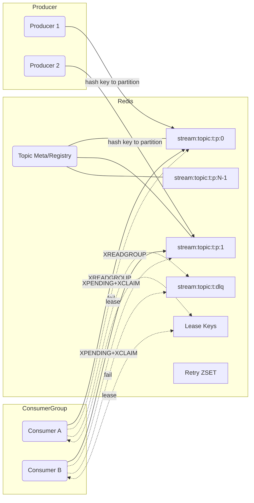
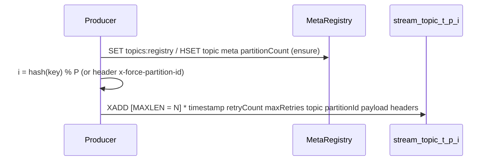
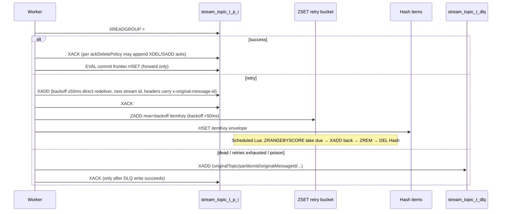
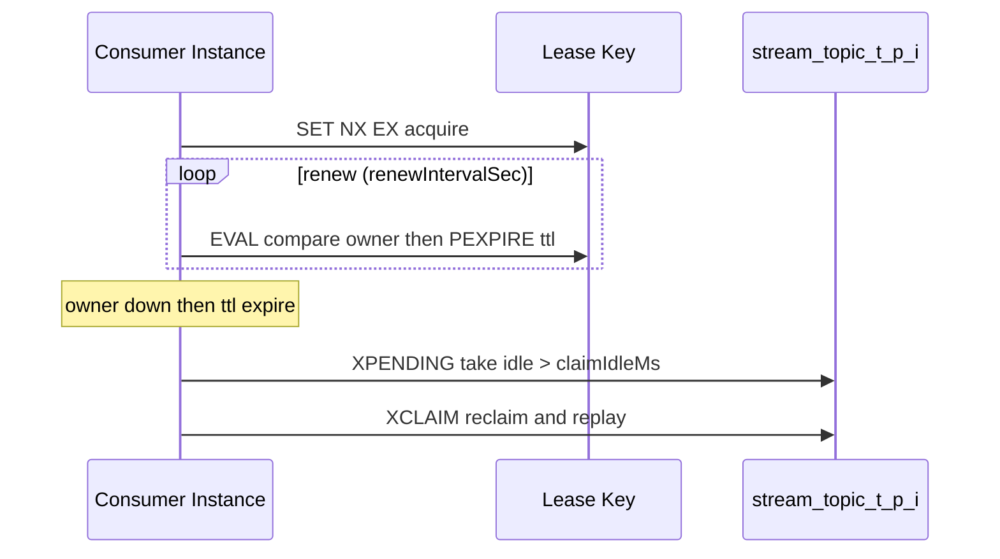

# MQ Design (Redis Streams)

[中文](../MQ-Design.md) | [English](MQ-Design-en.md)

---

This document is the design specification for the `mq/` module (Redis Streams-based message queue), covering partitioning, consumer groups & rebalance, retry & DLQ, admin & observability. Class names, method names, key names, and defaults are aligned with `mq/src/main/java`; Redis command-level interactions are in [MQ-Broker-Interaction.md](./MQ-Broker-Interaction.md).

## Goals

- High throughput, low latency; horizontally scalable (partitions + consumer groups).
- Semantics: At-Least-Once, with configurable retry and dead-letter.
- Robust: automatic orphan pending reclaim (`XPENDING + XCLAIM`), lease rebalancing, graceful shutdown.
- Operable: unified topic registry & metadata, aggregated stats, pluggable metrics.

## Concepts

- **Topic**: logical topic (single external name, e.g., `orders`).
- **Partition**: physical Redis Stream for parallelism, key `{streamKeyPrefix}:{topic}:p:{i}` (default `stream:topic:orders:p:{0..P-1}`).
- **Consumer Group**: load-sharing within a group; groups are independent.
- **Consumer Instance**: a process can lease multiple partitions (cap `maxLeasedPartitionsPerConsumer`, 0 = `workerThreads`).
- **Lease**: Redis string key + TTL implementing partition exclusivity (at most one instance per group consumes a partition at a time).
- **DLQ**: one dead-letter stream per Topic: `{streamKeyPrefix}:{topic}:dlq`.

## Architecture

```mermaid
flowchart LR
  subgraph Producer
    P1(Producer 1)
    P2(Producer 2)
  end
  subgraph Redis
    direction TB
    META(Topic Meta/Registry)
    P0[stream:topic:t:p:0]
    P1s[stream:topic:t:p:1]
    PNs[stream:topic:t:p:N-1]
    DLQ[stream:topic:t:dlq]
    LEASE[Lease Keys]
    RETRY[Retry ZSET]
  end
  subgraph ConsumerGroup
    C1(Consumer A)
    C2(Consumer B)
  end
  P1 -->|hash key to partition| P0
  P2 -->|hash key to partition| P1s
  C1 -->|XREADGROUP| P0
  C2 -->|XREADGROUP| P1s
  C1 -.XPENDING+XCLAIM.-> P0
  C2 -.XPENDING+XCLAIM.-> P1s
  C1 -.fail.-> DLQ
  C2 -.fail.-> DLQ
  C1 <-.lease.-> LEASE
  C2 <-.lease.-> LEASE
  META --- P0
  META --- P1s
  META --- PNs
```

## Partitioning

- Parallelism: P partitions processed by multiple instances, total throughput scales with partition count.
- Hotspot isolation: hot keys only block their partition.
- Redis Cluster friendly: partition keys spread across slots.
- Trade-offs: growing partition count changes key→partition mapping (`updatePartitionCount` only allows increase, does not rewrite already-delivered messages); more workers; rebalance is eventually consistent.

## Partition Metadata & Registry

- `{keyPrefix}:topics:registry` (Set): all Topics (`TopicRegistry`, avoids `KEYS/SCAN`).
- `{keyPrefix}:topic:{t}:meta` (Hash): field `partitionCount` (`TopicPartitionRegistry`).
- `{keyPrefix}:topic:{t}:partitions` (Set): partition stream keys.
- Missing/unparseable meta falls back to partition count = 1.

## Producer

- Routing: default `HashPartitioner` (`String.hashCode() % P`, random when key is null); `Partitioner` is a single-method interface, replaceable (repo currently only has Hash implementation, no RR/consistent-hash).
- Forced partition: header `x-force-partition-id` (`MqHeaders.FORCE_PARTITION_ID`) honored by `HashBrokerRouter` and produce path; DLQ replay relies on it to return to original partition.
- Write (`RedisBrokerPersistence.append`): first write registers Topic + meta; entry fields serialized to strings, Lua `XADD ... MAXLEN = N` atomically appends and trims by `retentionMaxLenPerPartition` (`=` exact semantics, Redis 7+; older versions fall back to approximate `XTRIM` + paged `XDEL` hard cap).
- Broker abstraction: `Broker = BrokerRouter (pick partition) + BrokerPersistence (persist)`, assembled by `BrokerFactory`; default `RedisBrokerFactory`, also `JdbcBrokerFactory` (MySQL table `rs_messages`, implements produce `append` only, reads still use Redis stream semantics).

## Consumer Groups & Rebalance

- Semantics: within a group "one partition consumed exclusively by one instance"; one instance can consume multiple partitions.
- Group creation: `subscribe` uses Lua for idempotency — `XINFO GROUPS` check then `XGROUP CREATE <stream> <group> 0-0 MKSTREAM`, `BUSYGROUP` treated as exists. Because group is created at `0-0`, backlog before group creation is also delivered (`>` means "not delivered to this group").
- Lease (`lease.LeaseManager`): acquire with `SET NX EX` (atomic, crash leaves no keyless lease); renew/release via Lua "value equals my id then `PEXPIRE`/`DEL`", avoids deleting successor's new lease. Key `{keyPrefix}:lease:{t}:{g}:{i}`.
- Reclaim: scheduler thread per `pendingScanIntervalSec` runs `XPENDING` (Redisson `listPending`) on owned partitions, claims entries idle > `claimIdleMs` via `XCLAIM` (Redisson `claim`) and replays handler. Implementation does not use `XAUTOCLAIM`.
- Workers: one serial worker per partition (`consumerPool`); separate scheduler thread pool (`schedulerPool`) for rebalance (`rebalanceIntervalSec`), renew (`renewIntervalSec`), pending scan, delayed retry mover (`retryMoverIntervalSec`).
- Concurrency cap: `maxInFlight > 0` uses semaphore to limit per-instance concurrent handling (MQ-08: unpaired permits on stop not released, avoids permanent quota shrink); `maxLeasedPartitionsPerConsumer` limits active partitions per instance.
- Subscription-level filtering: `SubscriptionOptions.partitionModulo/partitionRemainder` lets an instance only lease partitions where `i % mod == rem % mod`.

## Retry & DLQ

- At-least-once: failures retry; exhausted retries go to DLQ.
- Strategy interface `retry.RetryPolicy` has two methods: `getMaxAttempts()` and `nextBackoffMs(attempt)`; built-in `ExponentialBackoffRetryPolicy` (`baseMs * 2^(n-1)` capped at `maxBackoffMs`, shift saturates at 62 to avoid overflow). No `DeadLetterPolicy` class exists in repo; "fail to DLQ" rule is hardcoded in consume path.
- Actual retry cap = `min(message.maxRetries, retryPolicy.maxAttempts)`; `Message` default `maxRetries=3` (constructor), `retryMaxAttempts` default 5.
- Failure path (`RETRY`):
  1. Record `x-original-message-id` (retry produces new stream id, original id kept for correlation/dedup).
  2. Backoff ≤ 50ms: direct re-delivery to partition stream with new id.
  3. Otherwise write retry Hash `{keyPrefix}:retry:item:{t}:{uuid}` (fields topic/partitionId/payload/key/headers/retryCount/maxRetries/originalMessageId) + retry ZSET `{keyPrefix}:retry:{t}` (score=due timestamp).
  4. Mover thread holds `streaming:mq:retry:lock:{t}` lock, Lua atomically executes "ZRANGEBYSCORE take due → XADD back to partition → ZREM → DEL Hash", up to `retryMoverBatch` per round.
  5. Original message ACKed only after requeue succeeds (reverse order loses messages).
- Terminal failure (`FAIL`/`DEAD_LETTER`/retries exhausted): assemble `DeadLetterRecord`, write `{streamKeyPrefix}:{t}:dlq` (fields originalTopic/payload/timestamp/failedAt/retryCount/partitionId/headers/originalMessageId/maxRetries), DLQ write success then ACK; write failure keeps pending for redelivery.
- Poison messages (MQ-06): parse failures (corrupt timestamp, missing payload ref, etc.) go straight to DLQ and ACK to avoid infinite re-claim; headers carry `x-payload-missing` / `x-payload-missing-ref`.
- Pros: deterministic, observable, avoids hot loops; Cons: retry generates new IDs; delayed retry needs mover task.

## ACK & Delete Policy

`MqOptions.ackDeletePolicy` (default `none`) executed by `DefaultBroker.ack`:

- `none`: only `XACK`, entry stays in stream, cleaned by retention.
- `immediate`: `XACK` then `XDEL` (single-group consumption only).
- `all-groups-ack`: `SADD` group to `{keyPrefix}:acks:{t}:p:{i}:{id}` (TTL `acksetTtlSec`); when ack set covers "registered group count" (`XINFO GROUPS` count, includes stopped groups — MQ-04: registered groups are delivery contract, cannot use live lease count) then `XDEL` and delete set.

## Commit Frontier

- After ACK, Lua atomically maintains `{keyPrefix}:commit:{t}:p:{i}` (Hash, field=group, value=max acknowledged stream id, MQ-11): only `HSET` when new id (ms-seq compare) > stored value, eliminates concurrent ack worker read-after-write regression; stored value unquoted then compared by ms-seq, non-stream-id legacy values overwritten (self-healing).
- Frontier is currently observability/ops info (Admin group stats use `XINFO` last-delivered-id), not used for consumption start decisions.

## Large Payload Lifecycle (`impl.PayloadLifecycleManager`)

- Threshold: `PayloadHeaders.MAX_INLINE_PAYLOAD_SIZE = 64KB`; oversize payload JSON stored at `{keyPrefix}:payload:{t}:p:{i}:{uuid}`, stream carries header `x-payload-hash-ref` / `x-payload-storage-type=hash`.
- Primary deletion path is ACK (`deletePayloadHashFromStreamData`); index fallbacks: per-Topic Set `{keyPrefix}:payload:idx:{t}` (`cleanupTopicPayloadHashes`, called by `deleteTopic`) and global time ZSET `{keyPrefix}:payload:ts` (`cleanupOrphanedPayloadHashes`).
- If `retentionMs > 0` configured, payload keys TTL capped at that value; default 0 (no TTL, ACK deletion takes precedence).
- DLQ replay: if ref still exists, renew/re-store; if ref lost, mark `x-payload-missing` and replay anyway.

## Admin & Observability

- Stats: `RedisMessageQueueAdmin` cross-partition aggregation per topic (length sum, first/lastId aggregate, group count max); lag approximated as per-partition `lastId` vs group `last-delivered-id` timestamp delta.
- Pending details: cross-partition sampling (≤200 per partition) merged & sorted, supports sort by idle/delivery-count/ID with `minIdleMs` filter.
- Maintenance: `trimQueue` (length, amortized across partitions) / `trimQueueByAge` (time-based, paged `XDEL`, page size system prop `mq.admin.test.trimAgePageSize` default 500); `deleteTopic` (partition streams/DLQ/meta/partition set/load hash + remove from registry); `resetConsumerGroupOffset` (delete and recreate group at `0-0`/`$`/specific id); `updatePartitionCount` (grow only).
- Metrics (`metrics.MqMetricsCollector`, default Noop; starter provides Micrometer impl): counters `incProduced/incConsumed/incAcked/incRetried/incDeadLetter/incPayloadMissing/incDlqDelete/incDlqClear`, gauges `setInFlight/setEligiblePartitions/setLeasedPartitions/setMaxLeasedPartitions`, timers `recordHandleLatency/recordBackpressureWait/recordDlqReplay`; retention trim via `RetentionMetricsCollector.recordTrim/recordDlqTrim`. Labels include topic, partitionId, consumerName, group.

## Retention Policy

- Length: `retentionMaxLenPerPartition` (default 100000) executed atomically on write path (`XADD ... MAXLEN = N`).
- Time: `retentionMs`, `dlqRetentionMs` and period `trimIntervalSec` consumed by spring-boot-starter's `StreamRetentionHousekeeper` background task (`XTRIM MAXLEN ~` / `XTRIM MINID ~`); mq module itself does not use these for trimming (`retentionMs` only serves as payload TTL ceiling).
- DLQ length override `dlqRetentionMaxLen` (default 0=disabled) also only consumed by starter housekeeper.

## Relation to Kafka

- Semantic correspondence: partitions / exclusive consumption within a group / rebalance / lag aggregation; the coordination mechanism is replaced by Redis keys + `XPENDING+XCLAIM`.
- Advantages: no external coordinator required; easy to deploy.
- Limitations: leases are eventually consistent; Redis memory and network overhead.

## Sequences

### Produce

```mermaid
sequenceDiagram
  participant P as Producer
  participant M as MetaRegistry
  participant S as stream_topic_t_p_i
  P->>M: SET topics:registry / HSET topic meta partitionCount (ensure)
  P->>P: i = hash(key) % P (or header x-force-partition-id)
  P->>S: XADD [MAXLEN = N] * timestamp retryCount maxRetries topic partitionId payload headers
```

### Consume / Retry / Dead Letter

```mermaid
sequenceDiagram
  participant W as Worker
  participant S as stream_topic_t_p_i
  participant RB as ZSET retry bucket
  participant RH as Hash items
  participant DL as stream_topic_t_dlq
  W->>S: XREADGROUP >
  alt success
    W->>S: XACK (per ackDeletePolicy may append XDEL/SADD acks)
    W->>S: EVAL commit frontier HSET (forward only)
  else retry
    W->>S: XADD (backoff ≤50ms direct redeliver, new stream id, headers carry x-original-message-id)
    W->>S: XACK
    W->>RB: ZADD now+backoff itemKey (backoff >50ms)
    W->>RH: HSET itemKey envelope
    Note over RB: Scheduled Lua: ZRANGEBYSCORE take due → XADD back → ZREM → DEL Hash
  else dead / retries exhausted / poison
    W->>DL: XADD (originalTopic/partitionId/originalMessageId/...)
    W->>S: XACK (only after DLQ write succeeds)
  end
```

### Lease & Reclaim

```mermaid
sequenceDiagram
  participant C as Consumer Instance
  participant L as Lease Key
  participant S as stream_topic_t_p_i
  C->>L: SET NX EX acquire
  loop renew (renewIntervalSec)
    C->>L: EVAL compare owner then PEXPIRE ttl
  end
  Note over C: owner down then ttl expire
  C->>S: XPENDING take idle > claimIdleMs
  C->>S: XCLAIM reclaim and replay
```

## Redis Commands vs Kafka

The core Redis commands the implementation actually uses, mapped to Kafka features (Redisson already wraps the raw commands; the underlying commands are listed here for comparison and troubleshooting):

- Produce (Kafka Producer → send to a partition)
  - `XADD stream:topic:{t}:p:{i} * field value …`: appends a message and returns an id of the form `timestamp-seq`; with retention enabled it becomes `XADD ... MAXLEN = N`.
  - Kafka mapping: producer sends to a Topic Partition (Kafka assigns the offset; Redis generates the id from the stream).

- Consume and consumer groups (Kafka Consumer/Group → fetch/commit)
  - `XGROUP CREATE <stream> <group> 0-0 MKSTREAM` (both `subscribe` and the Broker read path make this idempotent via Lua, swallowing `BUSYGROUP`).
  - `XREADGROUP GROUP <g> <c> COUNT n BLOCK ms STREAMS <stream> >`: reads undelivered entries; corresponds to the Kafka fetch.
  - `XACK <stream> <group> <id ...>`: acknowledges and removes from the PEL; corresponds to commit.
  - `XPENDING <stream> <group>` (Redisson `listPending`): lists unacked entries (idle, delivery count); Kafka has no direct equivalent and infers it from offsets/monitoring.

- Failure recovery and rebalance (Kafka Rebalance/Coordinator → partition exclusivity and orphan takeover)
  - `SET key value NX EX ttl`: acquires the partition lease; renew/release runs Lua that compares the owner id before `PEXPIRE`/`DEL`.
  - `XCLAIM <stream> <group> <consumer> <min-idle-time> <id>`: claims pending entries past the idle timeout (the implementation combines `listPending + claim`; `XAUTOCLAIM` is not used).
  - Kafka mapping: the group coordinator assigns partitions and heartbeats keep the session alive; after rebalance, unacked messages are taken over.

- Delayed retry (Kafka retry topics/backoff → Redis delay bucket + Lua mover)
  - `ZADD streaming:mq:retry:{t} <dueAtMs> <itemKey>`: enqueues into the bucket by due time.
  - `HSET streaming:mq:retry:item:{t}:{uuid} topic ... partitionId ... payload ... key ... headers ... retryCount ... maxRetries ... originalMessageId ...`: multi-field string envelope (payload/headers JSON-encoded; a null payload omits the field).
  - `EVAL <lua>`: under lock, atomically executes `ZRANGEBYSCORE` for due items → `XADD` back to the partition → `ZREM` → `DEL` Hash.
  - Kafka mapping: retry topic buckets by delay, then re-sends to the main topic.

- Dead letters (Kafka DLQ → Redis DLQ stream)
  - `XADD stream:topic:{t}:dlq * ...` with fields `originalTopic / partitionId / originalMessageId / retryCount / maxRetries / timestamp / failedAt / headers / payload`.
  - Replay: read with `XRANGE <dlq> <id> <id>`, then `XADD` back to the original partition by `partitionId` (or `x-force-partition-id`); replay does not auto-`XDEL` DLQ entries.

- Topic governance (Kafka topic management/retention/delete → Redis management)
  - `XINFO STREAM / XINFO GROUPS` (Redisson `getInfo`/`listGroups`): stream and group stats.
  - `XTRIM MAXLEN = N` (write path, exact) / `XTRIM MAXLEN ~ N`, `XTRIM MINID <id>` (periodic, starter housekeeper) / paged `XDEL` (`trimQueueByAge`, hard-cap fallback).
  - `DEL <key ...>`: `deleteTopic` removes partition streams/DLQ/meta etc. (destructive — data loss).

| Redis Command | Kafka Mapping |
|---|---|
| `XADD` | Producer → partition |
| `XREADGROUP` / `XACK` | fetch / commit |
| `XPENDING` | in-flight (Kafka infers from lag/monitoring) |
| Lease + `XPENDING`+`XCLAIM` | Group coordinator / rebalance |
| `ZADD`+Hash + Lua mover | Retry topic / delayed replay |
| `stream:topic:{t}:dlq` | DLQ topic |
| `XADD ... MAXLEN =` / `XTRIM` | retention |

---

**Version**: 0.2.0
**Last Updated**: 2026-10-05

References:
- Redis Streams: XADD / XREADGROUP / XACK / XPENDING / XCLAIM / XTRIM / XDEL
- Kafka: Partition & Consumer Group design
- Command-level interactions & sequence diagrams: [MQ-Broker-Interaction.md](./MQ-Broker-Interaction.md)
- Full configuration table: [MQ.md](../MQ.md)