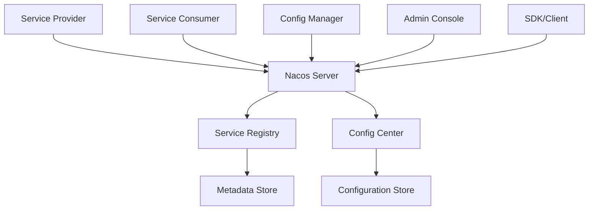

# Nacos角色关系图

Nacos作为一个动态服务发现、配置管理和服务管理平台，包含以下几个核心角色：

## 1. 核心角色及职责

### Service Provider（服务提供者）
- 提供可重用和可调用的服务
- 启动时向Nacos注册服务实例
- 关闭时从Nacos注销服务实例
- 定期发送心跳保持服务实例活跃状态

### Service Consumer（服务消费者）
- 发起对服务的调用
- 从Nacos查询可用的服务实例
- 订阅服务变化通知

### Nacos Server（Nacos服务端）
- 服务注册与发现的核心组件
- 配置管理平台
- 提供HTTP RESTful API接口
- 支持集群部署模式

### Service Registry（服务注册中心）
- 存储服务、实例和元数据的数据库
- 管理服务实例的注册和注销
- 执行服务实例的健康检查

### Config Center（配置中心）
- 提供动态配置管理
- 管理服务元数据和配置
- 支持配置的版本管理和变更推送

## 2. 核心组件关系

### Naming Service（命名服务）
- 将分布式系统中所有对象和实体的"名称"映射到相关联的元数据
- 服务发现和DNS是命名服务的两个主要场景

### Metadata Store（元数据存储）
- 存储描述服务的数据，如服务端点、服务标签、服务版本等
- 存储服务实例权重、路由规则、安全策略等信息

### Configuration Store（配置存储）
- 存储系统配置参数
- 支持配置的编辑、存储、分发和变更管理

## 3. 工作流程

### 服务注册流程：
1. 服务提供者启动时，通过SDK向Nacos Server注册服务实例
2. Nacos Server将服务实例信息存储在Service Registry中
3. 服务提供者定期发送心跳以维持注册状态

### 服务发现流程：
1. 服务消费者向Nacos Server查询可用的服务实例
2. Nacos Server从Service Registry中获取服务实例列表并返回
3. 服务消费者缓存服务实例列表并建立连接

### 配置管理流程：
1. 管理员通过Admin Console或API修改配置
2. Nacos Server将配置变更推送给相关的服务实例
3. 服务实例接收到配置变更通知后更新本地配置

## 4. 部署模式

Nacos支持两种启动模式：
1. **合并模式**：将服务注册中心和配置中心合并部署在同一个进程中
2. **集群模式**：将服务注册中心和配置中心分别部署在不同的集群中

## 5. Redis Streaming实现

Redis Streaming项目参考Nacos架构设计，但针对Redis特性进行了优化：

### 角色映射：
- **Service Provider** → `ServiceProvider`接口及实现
- **Service Consumer** → `ServiceConsumer`接口及实现
- **Nacos Server** → `NamingService`和`ConfigCenter`接口及实现
- **Service Registry** → 基于Redis数据结构的服务注册存储
- **Config Center** → 基于Redis数据结构的配置存储

### 技术优势：
1. **高性能**：基于Redis内存数据库，提供毫秒级的服务发现延迟
2. **简化部署**：利用Redis成熟的高可用方案，降低系统复杂度
3. **高效通知**：基于Redis Pub/Sub实现高效的消息广播能力
4. **自动过期**：利用Redis TTL机制实现自动健康检查

这种架构设计使得Redis Streaming能够同时满足服务发现和配置管理的需求，为构建云原生应用提供了完整的解决方案。