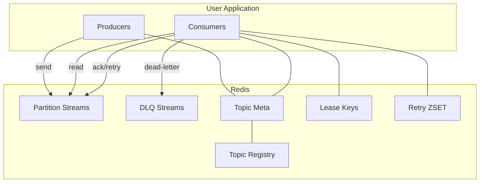

# System Architecture Overview

This document describes the overall architecture with focus on the MQ (Redis Streams) subsystem. It complements `redis-mq-design.md` and explains module boundaries and interactions.

## Modules
- core: shared abstractions, utilities.
- mq: Redis Streams based messaging (producer/consumer/admin).
- registry: service/metadata registry helpers.
- runtime: engine for streaming jobs (uses mq and state).
- state/window/aggregation/join/cdc/sink/source: processing semantics (not detailed here).
- metrics: Micrometer integration.
- spring-boot-starter: auto-config & ops.
- examples: runnable samples.

## Logical Architecture

## Runtime Threads
- Producer: lightweight; optional batch & XTRIM.
- Consumer instance:
  - Partition workers: 1 per owned partition (serial).
  - Scheduler pool: lease renewals, XAUTOCLAIM recovery, metrics collection, delayed retry mover.

## Failure Handling
- Consumer crash: lease expires; another instance acquires; uses XAUTOCLAIM on pending with idle threshold.
- Handler failure: retry via delayed re-enqueue; terminal send to DLQ.
- Redis outage: exponential backoff reconnect; metrics & logs for SRE.

## Observability
- Metrics (counters, gauges, timers) with labels: topic, partitionId, group, consumerId.
- Admin API aggregates across partitions; DLQ browsing & replay.

## Design Trade-offs
- Coordinator-less rebalance via leases: simpler infra, eventual consistency risk; mitigated by short TTL and idempotency.
- Per-partition serial workers: preserve order, easier reasoning; increases thread count (use multi-stream read if needed).
- Delayed retry via ZSET: predictable backoff; adds mover job.

Refer to `docs/redis-mq-design.md` for details, rationale, and sequence diagrams.
