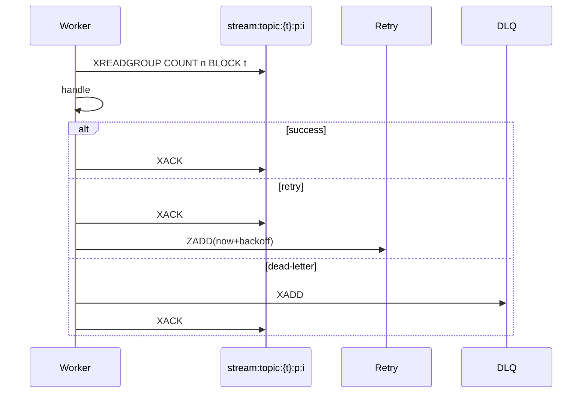

# Redis MQ Broker Interaction

This document captures the client<->Redis interactions used by the MQ subsystem.

## Key Commands
- XADD: append entries to partition streams or DLQ.
- XREADGROUP: read from partition streams within a group.
- XACK: acknowledge processed messages.
- XPENDING: inspect pending messages.
- XAUTOCLAIM: reclaim orphaned pending messages by idle time.
- XTRIM: retention by length; time-based retention via ID boundaries.
- SET NX EX: used for lease acquisition with TTL; EXPIRE to renew.
- ZADD/ZRANGEBYSCORE/ZREM: delayed retry bucket operations.

## Produce Flow

## Consume Flow

## Rebalance & Recovery

## Retention & Cleanup
- Prefer XTRIM MAXLEN for length-based retention.
- Time-based cleanup: compute boundary IDs then delete ranges (avoid full range reads).

## Rationale
- Using first-class Redis Streams commands and minimal coordination primitives keeps infra simple and portable.
- XAUTOCLAIM is critical to automatic recovery of orphaned pending entries.

