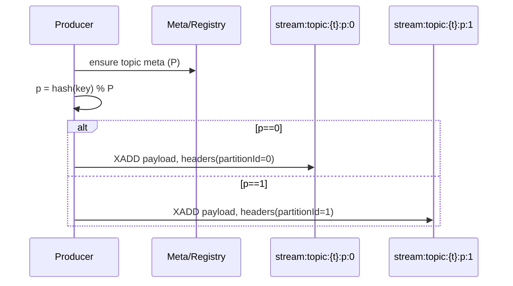
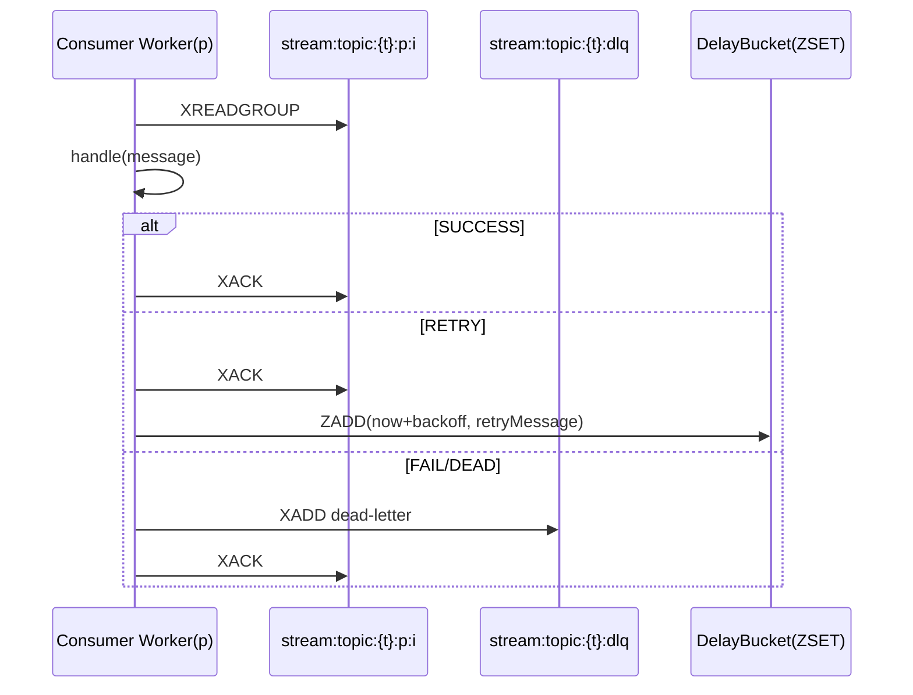

# Redis-Streaming MQ Design (Partitioned, Retry/DLQ, Admin, Metrics)

This document specifies the message queue design of redis-streaming, including partitioning, consumer groups, rebalance, retry & DLQ, admin operations, and observability. It explains why each choice is made, references, pros/cons, and includes architecture diagrams.

## Goals & Non-Goals
- Goals
  - High-throughput, low-latency stream processing on Redis Streams.
  - Horizontal scalability via partitions and consumer groups.
  - At-least-once processing semantics with configurable retry & DLQ.
  - Robustness: stalled consumers recovery (XAUTOCLAIM), rebalancing, graceful shutdown.
  - Operability: consistent topic registry, admin APIs, metrics.
- Non-Goals
  - Exactly-once processing (left to user idempotency or external dedupe).
  - Global total ordering across all messages (we provide per-key order via partitioning).

## Concepts & Terminology
- Topic: logical stream name seen by users, e.g. `orders`.
- Partition: physical Redis Stream for parallelism, keys: `stream:topic:{orders}:p:{0..P-1}`.
- Consumer Group: subscribers sharing load for a topic (across partitions), e.g. `orders-group`.
- Consumer Instance: a process (or thread) that can own 0..N partitions.
- Lease: lightweight exclusive assignment per partition per group using Redis keys with TTL.
- DLQ: single per-topic dead-letter stream for failed messages: `stream:topic:{orders}:dlq`.

## High-Level Architecture
```mermaid
flowchart LR
  subgraph Producers
    P1(Producer 1)
    P2(Producer 2)
  end
  subgraph Redis[Redis / Redis Cluster]
    direction TB
    TP((Topic Meta))
    R0[stream:topic:{t}:p:0]
    R1[stream:topic:{t}:p:1]
    Rn[stream:topic:{t}:p:N-1]
    DLQ[stream:topic:{t}:dlq]
    REG[topics registry set]
    LZ[leases keys]
  end
  subgraph Consumers[Consumer Group g]
    C1(Consumer A)
    C2(Consumer B)
  end

  P1 -->|hash(key)->partition| R0
  P2 -->|hash(key)->partition| R1
  TP --- REG
  C1 <-.lease.-> LZ
  C2 <-.lease.-> LZ
  C1 -->|XREADGROUP| R0
  C2 -->|XREADGROUP| R1
  C1 -.XAUTOCLAIM.-> R0
  C2 -.XAUTOCLAIM.-> R1
  C1 -.send fail-> DLQ
  C2 -.send fail-> DLQ
```

### Why Redis Streams
- References: Redis Streams (XADD/XREADGROUP/XACK/XAUTOCLAIM), Kafka partitioning model.
- Pros: native persistence, consumer groups, pending tracking, low-latency.
- Cons: lacks a built-in coordinator (we add simple leases), memory-bound persistence.

## Partitioning
- Strategy: `partition = hash(key) % P` (user-supplied key required to preserve per-key order). Fallbacks: round-robin/random when no key.
- Physical layout: `stream:topic:{t}:p:{i}` for i in [0, P-1]. Partition count stored in meta.
- Guarantees: order within a partition; cross-partition ordering is not guaranteed.
- Why
  - Increase parallelism (throughput scales ~ linearly with P on multi-core/multi-instance; on Redis Cluster, slots distribute across nodes).
  - Isolate hotspots (hot keys queue only their partition).
  - Reduce PEL contention (pending lists per partition vs one giant PEL).
- References: Kafka topic partitions; Redis Streams multi-stream consumption.
- Pros
  - Scales with number of partitions; simple mental model.
- Cons
  - Adding partitions changes key->partition mapping (migration caveats); per-partition serialism requires mapping.

### Partition Metadata & Registry
- Keys
  - `streaming:mq:topics:registry` (Set): all logical topics.
  - `streaming:mq:topic:{t}:meta` (Hash): `partitionCount`, `createdAt`, optional `policies`.
  - `streaming:mq:topic:{t}:partitions` (Set): physical partition stream keys.
- Why
  - Avoid SCAN keys in prod; enumerate topics/partitions efficiently; stable governance.
- Pros
  - Explicit topology; easy aggregation.
- Cons
  - Slight write-path overhead to maintain registry/meta.

## Producer Design
- Routing
  - Use `Partitioner` SPI: default hash(key) % P; pluggable consistent hashing / round-robin.
  - Message fields include `partitionId` (header) for troubleshooting.
- Write Path
  - Register topic (idempotent) and ensure meta exists; XADD to the chosen partition.
  - Optional XTRIM policy (by length/time) per partition.
- Pros
  - Transparent to user (still a single topic API); observability-friendly.
- Cons
  - Slight extra Redis ops for meta/registry.

## Consumer Groups & Rebalance
- Model
  - Same group name across partitions; per-partition exclusive ownership by one consumer instance.
  - Ownership via lease keys: `streaming:mq:lease:{t}:{g}:{i}` = consumerId, TTL short (e.g., 15s), renewed by owner.
- Assignment
  - Each instance scans partitions, attempts to acquire missing leases using `SET NX EX` semantics.
  - Over-capacity instances remain idle; on owner death (no renew), leases expire, others acquire and resume.
- Recovery
  - Use `XAUTOCLAIM` with idle threshold to take over orphan pending records; fallback to `XCLAIM` if necessary.
- Why
  - Mimic Kafka coordinator semantics without external service; simple, robust.
- Pros
  - Fast failover; no centralized server; stable partition-order guarantee.
- Cons
  - Eventual consistency; brief overlap gaps if clocks/TTL skew (mitigated by idempotency and XAUTOCLAIM).

### Worker Model
- One serial worker per owned partition to preserve order; a consumer instance may run many workers.
- Separate scheduler thread-pool for: lease renewal, XAUTOCLAIM, metrics collection.
- Backpressure
  - Limit in-flight per worker; batch reads (count > 1); adaptive poll timeout.

## Retry & DLQ
- Semantics: at-least-once with bounded retries and DLQ.
- Policies
  - `RetryPolicy`: maxAttempts, backoff (fixed/exponential/jitter), requeue vs re-add, maxDelay.
  - `DeadLetterPolicy`: fields/headers normalization; per-topic single DLQ stream.
- Implementation Options
  1) Re-enqueue strategy: ACK + XADD new record with `retryCount+1` (simple, new messageId); or
  2) External counter: keep messageId stable, store retryCount externally (complex, avoids new IDs).
- Default: 1) re-enqueue with backoff via a delayed bucket (ZSET like `streaming:mq:retry:{t}` or Stream-based delay wheel), then mover job pushes back to the original partition.
- DLQ: send on terminal failure; include original topic, partitionId, originalMessageId, retryCount, failed stack cause if provided; provide admin replay API.
- Why
  - Deterministic terminal handling; observability of retries; avoid hot retry loops.
- Pros
  - Transparent and tunable behavior; safe defaults.
- Cons
  - Additional moving parts (delayed queue/mover); new IDs for retries.

## Admin & Operations
- Topic lifecycle
  - Create: write meta/registry; create partitions lazily on first write; ensure group creation on subscribe.
  - Delete: XTRIM or delete keys; unregister registry and meta.
- Observability
  - Per-topic aggregation across partitions: length, first/last IDs, createdAt/updatedAt.
  - Group stats: pending, consumers, lastDeliveredId per partition, aggregated lag = Σ(lastId - groupLastDeliveredId).
  - Pending browsing: merged paginated view across partitions.
- Maintenance
  - Trim: prefer `XTRIM` by length; time-based use ID boundary deletion.
  - Rebalance: expose who owns which partition and their heartbeats.

## Metrics (Micrometer-ready)
- Counters: produced, consumed, acks, retries, deadLetters.
- Gauges: topicLength, pendingCount, inflight, partitionsOwned.
- Timers: handleLatency, ackLatency, end-to-end latency.
- Tags: `topic`, `partitionId`, `group`, `consumerId`, `result`.

## Message & API Design
- Message
  - Fields: id, topic, key, payload, headers, timestamp, retryCount, maxRetries, partitionId (header), originalMessageId (for retries), replayedFrom.
- Producer API
  - `send(topic, key, payload)`; `sendBatch(List<Message>)` (optional); partitioner selection.
- Consumer API
  - `subscribe(topic, group, handler, options)`; options: `batchSize`, `pollTimeout`, `maxInflight`, `retryPolicy`.
- Admin API
  - Aggregated topic & group queries across partitions; DLQ browsing & replay.

## Compatibility & Migration
- No meta found => assume `partitionCount=1` and `stream key = topic` (legacy mode).
- Enabling partitions: create meta and new keys; for existing topics, announce mapping change or provide consistent hashing with virtual nodes to limit remap.

## Security & Limits
- Redis memory boundaries: implement retention (XTRIM) and monitor memory; compress payload externally if large.
- Backpressure to protect Redis and consumers.

## Pros & Cons Summary
- Pros
  - Scalable, fault-tolerant, operationally simple (no external coordinator), Kafka-like semantics on Redis.
  - Clear, aggregated admin view; rich metrics; replayable DLQ.
- Cons
  - Eventual-consistent rebalance; retry creates new IDs; Redis is memory-bound; cluster adds network hops.

## References
- Redis Streams commands: XADD, XREADGROUP, XACK, XPENDING, XAUTOCLAIM, XTRIM.
- Kafka Design: partitioning semantics, consumer groups & rebalancing.
- Backoff strategies: Exponential with jitter (AWS Architecture Blog).

## Sequences
### Produce with Hash Partitioning


### Consume & Retry with Backoff


### Rebalance with Leases
```mermaid
sequenceDiagram
  participant CA as Consumer A
  participant CB as Consumer B
  participant L as Lease Keys
  participant P as Partitions
  CA->>L: SETNX lease(p0), EX=15s
  CB->>L: SETNX lease(p1), EX=15s
  loop renew
    CA->>L: EXPIRE lease(p0)
    CB->>L: EXPIRE lease(p1)
  end
  note over CA: A crashes
  ... 15s later ...
  CB->>L: SETNX lease(p0)
  CB->>P: XAUTOCLAIM(p0, idle>threshold)
```

## Appendix: Key Names
- Topic registry: `streaming:mq:topics:registry`
- Topic meta: `streaming:mq:topic:{t}:meta`
- Partitions set: `streaming:mq:topic:{t}:partitions`
- Partition stream: `stream:topic:{t}:p:{i}`
- DLQ stream: `stream:topic:{t}:dlq`
- Lease: `streaming:mq:lease:{t}:{g}:{i}`
- Retry bucket: `streaming:mq:retry:{t}` (ZSET)
