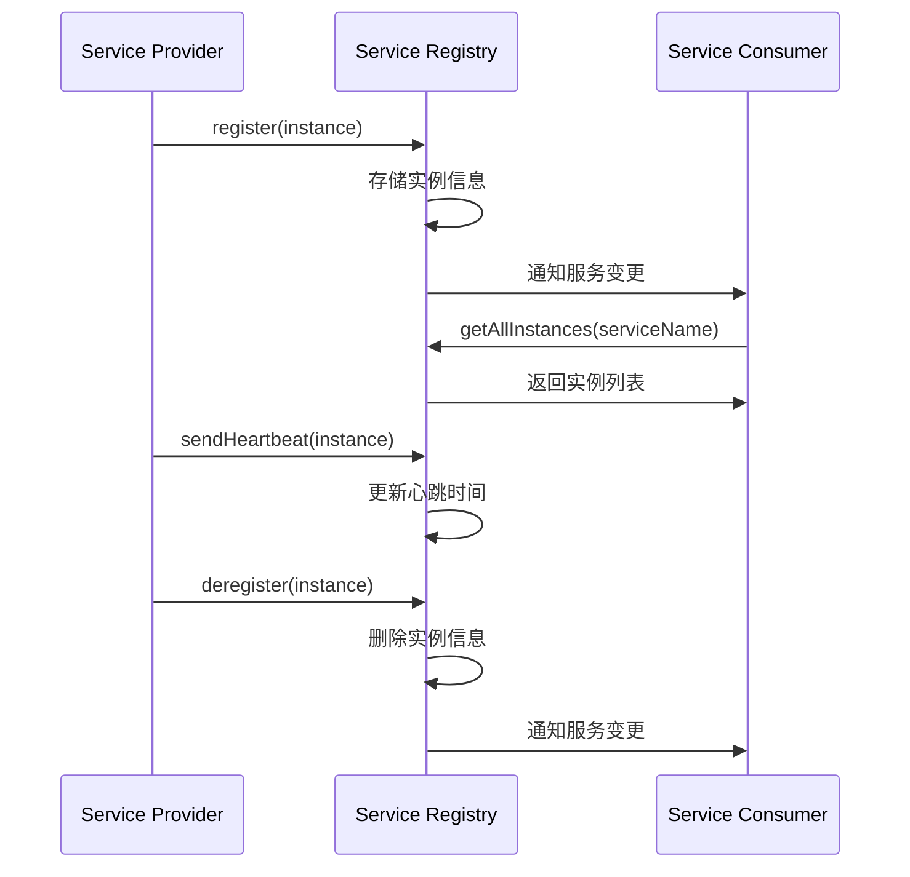
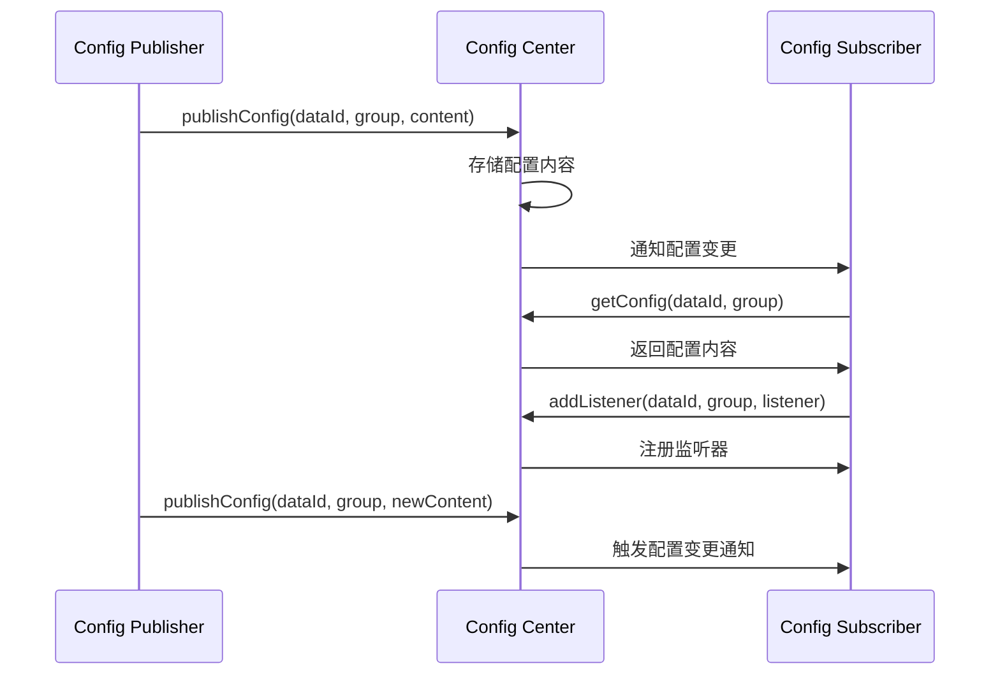

# 服务注册中心角色定义

本文档定义了服务注册中心中各个角色的职责和交互方式，参考Nacos架构设计。

## 核心角色

### 1. Service Provider（服务提供者）
服务提供者是分布式系统中提供可重用和可调用服务的组件。

#### 核心职责：
- **服务注册**：启动时向注册中心注册服务实例信息
- **心跳维护**：定期发送心跳以保持服务实例的健康状态
- **优雅下线**：关闭时主动注销服务实例
- **状态报告**：报告服务实例的运行状态和负载情况

#### 接口定义：
```java
public interface ServiceProvider {
    void register(ServiceInstance instance);
    void deregister(ServiceInstance instance);
    void sendHeartbeat(ServiceInstance instance);
    void batchSendHeartbeats(List<ServiceInstance> instances);
    void start();
    void stop();
    boolean isRunning();
}
```

### 2. Service Consumer（服务消费者）
服务消费者是分布式系统中调用其他服务的组件。

#### 核心职责：
- **服务发现**：查询可用的服务实例列表
- **服务订阅**：监听服务变更通知
- **负载均衡**：从实例列表中选择合适的目标实例
- **故障处理**：处理服务调用失败的情况

#### 接口定义：
```java
public interface ServiceConsumer {
    List<ServiceInstance> getAllInstances(String serviceName);
    List<ServiceInstance> getHealthyInstances(String serviceName);
    List<ServiceInstance> getInstances(String serviceName, boolean healthy);
    void subscribe(String serviceName, ServiceChangeListener listener);
    void unsubscribe(String serviceName, ServiceChangeListener listener);
    void start();
    void stop();
    boolean isRunning();
}
```

### 3. Config Publisher（配置发布者）
配置发布者负责管理和发布系统配置。

#### 核心职责：
- **配置发布**：向配置中心发布新的配置内容
- **配置更新**：更新已存在的配置
- **配置删除**：删除不再需要的配置
- **版本管理**：管理配置的历史版本

#### 接口定义：
```java
public interface ConfigPublisher {
    boolean publishConfig(String dataId, String group, String content);
    boolean publishConfig(String dataId, String group, String content, String description);
    boolean removeConfig(String dataId, String group);
    List<ConfigHistory> getConfigHistory(String dataId, String group, int size);
}
```

### 4. Config Subscriber（配置订阅者）
配置订阅者负责获取和监听配置变更。

#### 核心职责：
- **配置获取**：获取指定的配置内容
- **配置监听**：监听配置变更并及时响应
- **本地缓存**：缓存配置以提高访问性能
- **故障降级**：在配置中心不可用时使用默认配置

#### 接口定义：
```java
public interface ConfigSubscriber {
    String getConfig(String dataId, String group);
    String getConfig(String dataId, String group, String defaultValue);
    void addListener(String dataId, String group, ConfigChangeListener listener);
    void removeListener(String dataId, String group, ConfigChangeListener listener);
}
```

## 角色交互关系

### 服务注册与发现流程：



### 配置管理流程：



## 实现架构

### 注册中心实现：
```
io.github.cuihairu.redis.streaming.registry/
├── ServiceProvider.java              # 服务提供者接口
├── ServiceConsumer.java              # 服务消费者接口
├── NamingService.java                # 命名服务接口（整合Provider和Consumer）
├── ConfigPublisher.java              # 配置发布者接口
├── ConfigSubscriber.java             # 配置订阅者接口
├── ConfigCenter.java                 # 配置中心接口（整合Publisher和Subscriber）
├── impl/
│   ├── RedisNamingService.java       # Redis命名服务实现
│   ├── RedisServiceRegistry.java     # Redis服务注册实现
│   ├── RedisServiceDiscovery.java    # Redis服务发现实现
│   ├── RedisConfigService.java       # Redis配置服务实现
│   └── RedisConfigCenter.java        # Redis配置中心实现
```

## 最佳实践

### 1. 服务提供者最佳实践：
- 启动时立即注册服务实例
- 定期发送心跳（建议每30秒一次）
- 优雅关闭时主动注销服务
- 合理设置实例权重和元数据

### 2. 服务消费者最佳实践：
- 缓存服务实例列表以提高性能
- 实现合适的负载均衡策略
- 处理服务实例不可用的情况
- 及时订阅服务变更通知

### 3. 配置管理最佳实践：
- 使用有意义的dataId和group命名
- 为配置添加适当的描述信息
- 监听配置变更并及时应用
- 处理配置中心不可用的降级方案

通过明确角色职责和交互关系，我们可以构建一个清晰、可维护的微服务架构。